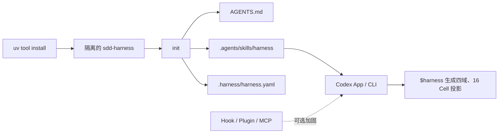

# SDD Harness

Harness 是面向 Codex App / Codex CLI 的仓库脚手架（repository
scaffold）。它通过一个隔离安装的确定性程序，把仓库级 Skill、项目策略和
可验证治理投影发布到目标仓库。当前契约版本为 `2.0.0`。

## 快速开始

```text
uv tool install <source-or-package>
cd <target-repository>
sdd-harness init . --yes
```

随后直接在 Codex App 或 CLI 中描述任务，或显式使用：

```text
$harness 修改解析器并运行最低充分验证
```

`sdd-harness init` 是确定性初始化入口；仓库内
`.agents/skills/harness` 是正式用户入口。Plugin、Hook 和 MCP 都是显式
启用的纵深防御（defense in depth），不是基础依赖。初始化只发布入口；进入
Codex 后由 `$harness` 识别 Blue / Gray，并以独立零写入计划生成 5 个治理投影
文件。

## 2.0 架构



| 层 | 职责 | 实例 |
|---|---|---|
| 分发（distribution） | 隔离安装和版本握手 | `uv tool install` 后 PATH 上有 `sdd-harness` |
| 确定性内核（deterministic core） | 编译事实、Action Graph、Coverage、决定与证据 | 同一输入产生同一 `projection_id` |
| 仓库 Skill | 告诉 Codex 如何完成任务 | `$harness` 路由本地工作、Commit、Issue、交付 |
| 可选加固 | 提前发现旁路或漂移 | `sdd-harness init . --with-hooks` |

## 四个治理域

| Domain（域） | 处理什么 | 实例 |
|---|---|---|
| `specification` | 需求和 Issue Plan | 更新验收标准 |
| `implementation` | 源码和生成物 | 修改 Python 模块 |
| `verification` | Test、类型和契约验证 | `test:contracts` |
| `delivery` | Commit、远端 Issue、Push、PR、Release | 选择性 Commit |

`maintainer / consumer × generate / enforce × 四域` 固定形成 16 个 Cell。
它们由 Python 编译器一次生成，不依赖 16 次 Agent 推理。

## 用户只需理解两个决定

- 项目策略（Project policy）：写入 `.harness/harness.yaml`，供后续任务复用。
- 本次决定（Task decision）：只绑定当前任务或一个精确动作，工作区、投影或目标变化后立即失效。

例如，“以后 Issue 都写 GitHub”是项目策略；“现在提交 `src/a.py`”是本次决定。
Commit、Remote Issue、Push、PR 互不共享决定。

## 安全边界

- 普通本地修改连续执行，使用 T0–T3 最低充分验证。
- Action 只有一个主域，调用只能来自仓库事实，不能由模型发明命令。
- Controlled / Unclassified Branch 的直接写入、Commit 和交付失败关闭。
- Remote Issue 失败不会回退为本地 Issue。
- PR、Merge、Publish、Release、Deploy 必须同时绑定平台门禁证据和独立的本次决定。
- 临时 Git Index 只提交确认路径，并保留无关暂存状态。
- Coverage 缺失、重复或无来源的 `not_applicable` 都会阻断。

## 文档与验证

- [2.0 规范](docs/specification.md)
- [快速上手](docs/quickstart.md)
- [仓库结构](docs/repository-structure.md)
- [Issue #28 消费者验收证据映射](docs/issue-28-acceptance.md)
- [可观察用例](uc.md)
- [实施状态](plan.md)

本仓库的验证必须通过 `.harness/tools.yaml` 登记的 `task_ref` 执行。
