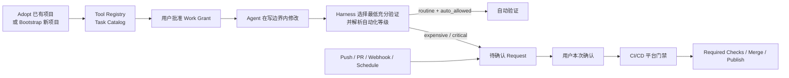

# AI Coding Harness

AI Coding Harness 是项目工作区、工具发现与 CI/CD 交付执行的统一控制层：它让 Agent / Skill 在明确写边界内工作，通过 Tool Registry 找到 Runtime、CLI、Shell、MCP、API 和脚本的正确入口，并按动作语义管理验证与正式交付。

> 当前状态：**P0–P4 Available；P5 In Progress**。`0.3` 已完成 Plan / Approval 分离、摘要链、能力校验和 P4 本地产品验收；真实平台 Evidence 仍按每个正式交付请求逐次校验。

## 为什么需要 Harness

Agent 通常能完成代码修改，但项目执行过程仍有三个高成本问题：

| 问题 | 例子 | Harness 的目标行为 |
|---|---|---|
| 越界写入 | 修复订单模块时顺手重构支付模块 | 范围内自由；范围扩大时停止并 Handoff |
| 工具调用试错 | 猜测 Python 入口、搜索命令或 MCP Tool 名称 | 通过 Registry 一次获得确定入口 |
| 不必要的全量验证 | 修改一份文档后执行完整 Build 和 Test | 根据实际影响选择最低充分验证集 |

Harness 不替代 Agent 的领域能力。它只回答三个项目执行问题：

```text
可以写到哪里？
应该使用什么工具？
完成修改后最少需要执行什么？
```

## 三个职责域

### 工作区写边界（Workspace Boundary）

Harness 记录一次 Work Grant 允许写入的路径。Agent / Skill 可以在范围内自由选择实现；范围扩张时必须停止并重新 Handoff。该机制负责声明和检查，不宣称宿主级拦截普通文件写入。

### 工具注册表（Tool Registry）

项目中的 Runtime、CLI、Shell、MCP Server、MCP Tool、API 和普通仓库脚本统一注册，条目说明用途、版本事实源、入口、工作目录、输入输出、适用场景和调用模式。

Registry 是项目能力索引，**不是** Agent / Skill 授权矩阵、逐次审批器或调用代理。Agent 查询后直接调用普通工具。

调用模式分为 `direct` 和 `managed`。注册了 `npm`、Python、Shell 或 GitHub MCP，不代表 Test、Build、Push、Merge、Publish、Release 或 Deploy 自动获得执行权；是否进入 Harness Task 由动作语义决定，与调用通道无关。

### 交付管理（Delivery Management）

命中 Test、Build、CI、Push、Merge、Publish、Release 或 Deploy 语义的动作注册为 CI/CD Task。Agent 可以提交 Change Manifest 和验证建议，Harness 根据实际 Diff 与项目规则选择最终验证集合，并应用三级自动化策略：

| 等级 | 行为 | 示例 |
|---|---|---|
| `routine` | 项目明确允许后可以自动执行 | 快速 Unit Test |
| `expensive` | 每次必须确认 | Integration、E2E、Full CI、大型 Build |
| `critical` | 每次确认，并同时经过 CI/CD 平台门禁 | Push、Merge、Publish、Release、Deploy |

未声明或无法分类的 CI/CD 动作默认只生成待确认 Request，不启动 Backend。

## 完整生命周期



### Adopt 已有项目

Harness 只读发现现有 Runtime、CLI、MCP、包脚本和 CI/CD，然后把已有实现映射为 Registry、Task 和 Adapter。原 Workflow 仍是执行事实源，不会被无条件重写。

### Bootstrap 新项目

Harness 根据实际技术栈建立最小工具索引、Task Catalog、Impact Rules、Merge Pipeline 和 Publish Pipeline。首批范围是 Local、GitHub Actions、Python 和 Node。

### 日常 Work

用户批准目标和写入范围后，Agent 在边界内修改并提交 Change Manifest。Harness 选择 `inspect`、`affected`、`contract`、`integration` 或必要的 `full`，再独立判断相应 Task 能否自动启动。推荐 `full` 不等于可以自动运行 Full CI。

### Merge 与 Publish

Merge、Publish、Release 和 Deploy 都属于 `critical`，每次必须获得绑定本次目标的明确确认。正式权限与结果由 CI/CD 平台的最小权限凭证、Required Checks、Branch Protection、Protected Environment 和审批状态提供。

## 普通能力与 CI/CD Task

| 类型 | 示例 | 调用方式 | 是否逐次审批 |
|---|---|---|---|
| 普通能力 | `rg`、Python 分析、Shell、普通 MCP Tool | 查询 `tools.yaml` 后直接调用 | 否 |
| 局部编辑工具 | 仅作用于批准文件的 Formatter | Agent 直接调用，写入受边界约束 | 否 |
| `routine` CI/CD | 显式允许的低成本 Unit Test | Harness 选择后自动调度 | 仅首次政策登记 |
| `expensive` CI/CD | Integration、E2E、Full CI、大型 Build | 生成本次 Request | 每次 |
| `critical` CI/CD | Push、Merge、Publish、Release、Deploy | 本次确认后提交平台门禁 | 每次 |

## 最终使用入口

最终产品以 `initialize-ai-coding-harness` Skill 为唯一用户入口：P2 提供 Adopt、Bootstrap、Audit 和 Update，P3 增加 Work、Verify、Merge 和 Publish。Python 3.12 作为内部确定性执行层；首版不发布独立公共 CLI。

### 接管已有项目

```text
请使用 initialize-ai-coding-harness 接管当前仓库已有的工具与 CI/CD。
先只读发现并给出 Adopt Plan，得到我确认后再写入。
```

### 初始化新项目

```text
请使用 initialize-ai-coding-harness 为当前项目建立最小 Harness。
先识别技术栈并给出 Bootstrap Plan，不要默认创建未选择的 CI Backend。
```

### 审查已有 Harness

```text
请审查当前 .harness 配置与仓库事实是否一致。
只输出漂移、缺口和 Evidence，不要修改文件。
```

### 日常修改与交付

```text
请通过 initialize-ai-coding-harness 在已批准范围内完成这次修改，
选择最低充分验证并进入 Merge；不要自行运行全量 CI。
```

需要 Publish 时，仍通过同一 Skill 生成绑定本次版本、制品和目标的 Publish Plan，并单独确认。

这些入口的完整目标体验见 [`docs/quickstart.md`](docs/quickstart.md)。

## 安装状态

本仓库已提供 `skills/initialize-ai-coding-harness/` 源 Skill。P0–P4 Available；P5 已进入安装与发布准备：不添加许可证并保持私有，计划从私有仓库 `bigsmartben/harness-scaffold` 的 `v0.3.0` 标签安装到当前用户 Codex Skills 目录。

## 首批支持范围

| 维度 | 首批支持 | 后续扩展 |
|---|---|---|
| 项目模式 | Adopt、Bootstrap、Audit、Update、Work、Verify、Merge、Publish | 组织级策略同步 |
| Runtime / 项目单元 | Python、Node、workspace Manifest 声明的 Monorepo 单元 | Java、移动端及其他 Runtime |
| Backend | Local、Git Remote（仅精确确认的非强推 Push）、GitHub Actions | GitLab CI、Jenkins、其他平台 |
| 验证 | Inspect、Affected、Contract、Integration、Full | 基于历史数据的动态优化 |
| 自动化 | `routine`、`expensive`、`critical` | 基于历史数据的成本优化 |
| 权限门禁 | GitHub Required Checks、Protected Environment、平台审批 | 其他 CI/CD 平台 |
| 范围边界 | 普通工具只注册引导；不做通用宿主强控 | 组织级策略服务 |

MCP、Make、Gradle/Maven、Fastlane 和未被 Manifest / Workflow 引用的仓库脚本在
0.3 中只形成 source-backed gap；Harness 不猜测其 Tool、Task 或 Adapter。

## 能力状态

`Available` 表示阶段交付物和阶段验收都已完成；`In Progress` 表示已有实现但阶段验收尚未闭合；`Planned` 表示范围已确定但尚未开始。

| 能力 | 状态 | 阶段 | 证据 |
|---|---|---|---|
| 规范、用户用例、仓库结构、Quickstart | Available | P0 | 本仓库 Markdown 文档 |
| YAML 配置契约与 Schema | Available | P1 | `uv run pytest` 契约与跨文件引用测试 |
| 目标项目模板与本仓库 `.harness/` | Available | P1 | Scaffold 文件快照与自举配置校验 |
| `initialize-ai-coding-harness` Skill | Available | P2 | 官方 Skill 结构验证 |
| Adopt、Bootstrap、Audit、Update | Available | P2 | Python、Node、现有 CI、空项目与 Monorepo Fixture 集成测试 |
| Work、Verify、Merge、Publish Skill 路由 | Available | P3 | 四类中英文路由及三级自动化语义测试 |
| 最低充分验证与 Task Runner | Available | P3 | 验证级别、自动化等级、零 Backend 调用与摘要测试 |
| Local、Git Remote 与 GitHub Actions Adapter | Available | P3 | 同形 Evidence、确认门禁、精确 Push 绑定和平台来源字段测试 |
| CI/CD 平台闭环 | Available | P4 | 本地 Fixture、Fake Adapter、零调用断言和独立目录流程验收通过 |
| Skill 安装与正式发布 | In Progress | P5 | 私有发布与当前用户安装目标已确认；尚未 Push、Release 或安装 |

详细依赖和验收条件见 [`plan.md`](plan.md)。

## 文档导航

| 文档 | 适合回答的问题 |
|---|---|
| [Harness 规范](docs/specification.md) | 什么是必须行为、失败状态和职责边界？ |
| [用户用例](uc.md) | 用户从触发到结果会观察到什么？ |
| [仓库结构](docs/repository-structure.md) | 开发仓库、Skill 和目标项目分别放什么？ |
| [Quickstart](docs/quickstart.md) | Adopt、Bootstrap、Work、Merge 和 Publish 如何串起来？ |
| [实施计划](plan.md) | 当前完成到哪里，下一阶段交付什么？ |

## 明确非目标

Harness 不负责：

- 产品需求、业务规则或架构决策。
- 垂直 Agent / Skill 的 Prompt、推理步骤和实现策略。
- 编译器、测试框架、CI Runner 或部署平台内部实现。
- 普通 Tool、MCP、CLI、Shell、网络或 Runtime 的逐次授权和宿主级强制拦截。
- 通用文件写入强制根或完整进程中介。
- 在缺少项目事实时猜测 Runtime、命令或验证范围。

完整规则及 blocker codes 以 [`docs/specification.md`](docs/specification.md) 为准。
