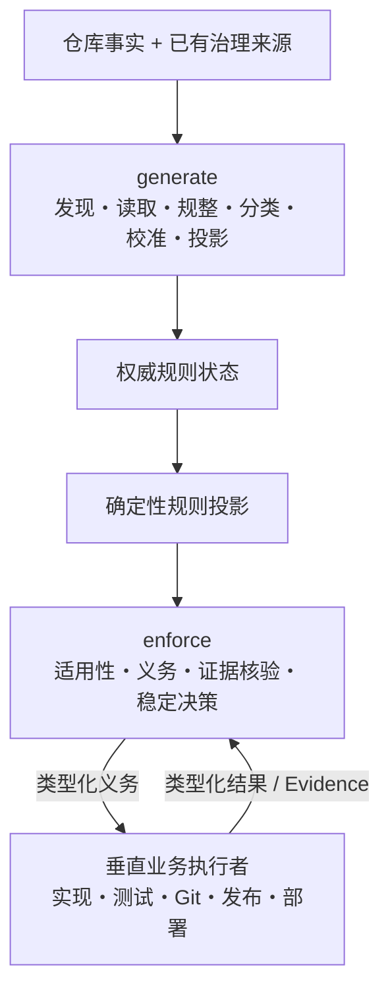

# Harness 2-2-4 治理模型白皮书

## 摘要

Harness 用三条正交轴表达仓库治理：

```text
2 Audience（适用方）
× 2 Responsibility（治理职责）
× 4 Governance Domain（治理域）
= 16 Cell（治理单元）
```

固定模型解决“谁”“系统承担什么责任”“规则讨论什么”三个问题。仓库规则可以
变化，16 个 Cell 的数量、顺序和值域不变。

## 模型图



calibration（校准）位于 generate 内部。它既不扩展固定轴，也不构成用户可选的
第三种 Responsibility。

## 三条轴

### Audience（适用方）

| 值 | 含义 | 实例 |
|---|---|---|
| `maintainer` | 维护 Harness 规范、机器合同和分发制品的一方 | 修改 `model.py` 并验证发布制品 |
| `consumer` | 在外部仓库使用 Harness 治理规则的一方 | 为业务仓库加载四域规则 |

维护仓库根目录不是 consumer。consumer 行为只在外部或临时仓库运行。

### Responsibility（治理职责）

| 值 | 含义 | 实例 |
|---|---|---|
| `generate` | 从事实与治理来源生成、读取、规整、分类、校准并投影规则 | 从 Python 项目元数据派生实现规则候选 |
| `enforce` | 脚手架内部建立保障义务并核验外部证据 | 核验测试 Worker 的结果是否满足 verification 规则 |

`validate` 模型结构只是内部一致性检查，不再等同于 `enforce`。

### Governance Domain（治理域）

| 值 | 问题 | 实例 |
|---|---|---|
| `specification` | 要达到什么结果？ | API 变更需要可观察验收条件 |
| `implementation` | 源码和配置怎样构造？ | 公共边界使用明确类型 |
| `verification` | 什么证据证明结果？ | 契约测试结果可重复 |
| `delivery` | 交付物怎样保持完整？ | 发布说明包含破坏性变更 |

## 规则如何映射到 Cell

假设 consumer 有一条 verification 规则：

```text
rule_id = contract-tests
revision = 3
domain = verification
```

它关联两个固定视图：

```text
consumer.generate.verification  ─┐
                                  ├─ 同一 rule_id / revision
consumer.enforce.verification   ─┘
```

- generate 视图证明规则来自当前事实或已有治理来源，并进入当前投影；
- enforce 视图引用同一 revision 的执行保障合同；
- 两个视图不会复制规则，也不会改变 Cell 数量；
- consumer 规则不会写入任何 `maintainer.*` Cell。

状态与映射关系如下：

| 规则情况 | generate/enforce 当前绑定 |
|---|---|
| enabled | 两个视图都绑定当前 revision |
| disabled | 保留身份与历史映射，不进入当前生效集合 |
| deleted | 不属于当前集合，无有效 Cell 绑定 |
| updated | 两个视图切换到新 revision，旧绑定 stale |

具体状态字段由 #51 定义，投影和 stale 行为由 #54 实现。

## 三层边界

```text
用户自然语言
   │
   ▼
Harness Skill ──类型化请求──> Harness 脚手架
                                  │
                                  ├─权威状态 / 投影 / 保障
                                  │
                                  └─义务与证据协议
                                           ▲
                                           │
                                  垂直业务执行者
```

正例：Skill 把“停用 contract-tests”解析为 disable 请求。

反例：Skill 看到 verification 规则后直接运行 `pytest`。运行测试属于垂直业务
执行者，不属于 Skill。

正例：脚手架核验外部提交的测试证据并返回 `satisfied` 或 `blocked`。

反例：脚手架把聊天中的“测试已通过”当成权威证据。

## 权威性与确定性

consumer 规则状态是 SSOT；投影和 enforcement 状态都是派生结果。相同仓库快照、
治理来源和类型化请求必须产生相同结果。事实、规则或 revision 改变后，旧投影及
旧证据必须失效。

这一关系避免三类常见错误：

| 错误 | 后果 | 模型处理 |
|---|---|---|
| 把投影当成第二份可编辑规则 | 两份规则互相漂移 | 投影只从权威状态重算 |
| 把 Skill 当业务执行器 | 治理接口越权 | Skill 只提交类型化请求 |
| 把 Schema 校验当执行保障 | 规则只是静态文字 | enforce 必须产生可观察义务与决策 |

## 历史合同边界

3.0.1 的 guidance-only（仅指导）和 contract-validation-only（仅合同校验）语义
是历史发布语义，不再定义当前产品。升级、bootstrap 和分发版本由 Epic #49 的
后续工作包统一完成，不能保留两个现行规则 SSOT。

完整规范见 [specification.md](specification.md)，实施状态见
[GitHub Epic #49](https://github.com/bigsmartben/harness-scaffold/issues/49)。
