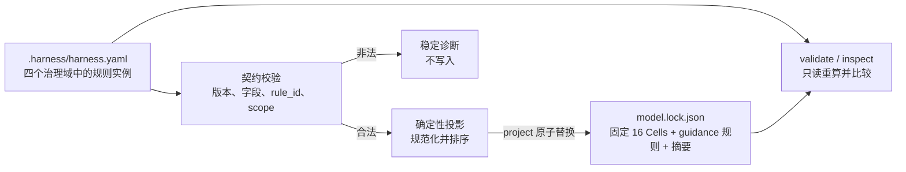

# Harness 3.0：2-2-4 治理模型白皮书

版本：`3.0.1`

状态：与 Harness 3.0.1 固定契约一致

## 摘要

Harness 是一个本地规范治理脚手架（specification governance scaffold）。
它用三条彼此正交的轴描述仓库治理：

```text
2 类 Audience（适用角色）
× 2 类 Responsibility（治理职责）
× 4 类 Governance Domain（治理域）
= 16 个 Cell（治理单元）
```

`2-2-4` 只是三组固定值的数量简称，不是三级组织结构，也不是用户可修改的配置。
模型把“谁使用治理信息”“系统怎样处理治理信息”和“治理信息讨论什么”分开，
避免把角色、职责和工程阶段混成一个含义不清的流程。

Harness 只验证并投影规范与指导。它不运行测试、不执行 Git、不选择分支、不授予
权限、不部署软件，也不连接远程 Provider（服务提供方）。

## 1. 模型要解决的问题

仓库规则经常把不同问题写在一起。例如：

> 发布负责人必须在合并前运行测试，然后部署到生产环境。

这句话同时混入角色、验证、分支、执行和交付动作，工具很难判断哪些内容是规范，
哪些内容需要外部系统执行。2-2-4 模型把问题拆成三个独立维度：

| 要回答的问题 | 使用的轴 | 具体示例 |
|---|---|---|
| 这份治理信息面向谁？ | Audience（适用角色） | Harness 维护者或接入 Harness 的仓库 |
| Harness 对治理信息承担什么职责？ | Responsibility（治理职责） | 确定性生成，或按固定契约校验 |
| 这份治理信息讨论哪类工程关注点？ | Governance Domain（治理域） | 需求、实现、验证或交付 |

拆分后，一条项目指导可以表达为：

```yaml
rule_instances:
  verification:
    - rule_id: run-contract-tests
      directive: 修改公共契约后应运行契约测试。
      scope:
        - src/**
        - tests/**
```

它只声明 verification（验证）域中的指导，不声明由谁执行测试、何时阻断合并，
也不赋予 Harness 执行测试的能力。

## 2. 三条固定轴

### 2.1 Audience（适用角色）

Audience 表示治理模型面向哪一类使用方。

| 固定值 | 中文含义 | 具体示例 |
|---|---|---|
| `maintainer` | 维护 Harness 固定契约和分发物的一方 | 修改 `src/harness_core/model.py` 的 Harness 维护者 |
| `consumer` | 在自己的仓库中接入并使用 Harness 的一方 | 在业务仓库编辑 `.harness/harness.yaml` 的团队 |

这里的 `maintainer` 和 `consumer` 是模型角色，不是 GitHub 权限组。某个人可以在
维护 Harness 时是 maintainer，在自己的业务仓库中又是 consumer。

### 2.2 Responsibility（治理职责）

Responsibility 表示 Harness 如何处理治理信息。

| 固定值 | 中文含义 | 具体示例 |
|---|---|---|
| `generate` | 按固定顺序确定性地产生模型或指导投影 | 同一份合法配置始终生成相同字节的模型锁 |
| `enforce` | 严格校验固定契约并拒绝模型漂移 | Cell ID 被篡改时，`validate` 返回诊断 |

`enforce` 是“约束 Harness 契约”，不是“强制执行项目动作”。例如，
`consumer.enforce.verification` 可以检查 verification 指导是否符合固定契约，
但不会运行测试或阻止 Pull Request。

### 2.3 Governance Domain（治理域）

Governance Domain 表示规则讨论的工程关注点。

| 固定值 | 中文含义 | 具体问题 | 指导示例 |
|---|---|---|---|
| `specification` | 规范 | 要实现什么，怎样验收？ | 实现前应给出可观察的验收条件 |
| `implementation` | 实现 | 源码应怎样构造？ | 公共边界应使用明确类型 |
| `verification` | 验证 | 怎样取得可检查的证据？ | 修改公共契约后应运行契约测试 |
| `delivery` | 交付 | 交付物应说明什么？ | 发布说明应列出破坏性变更 |

治理域是分类，不是自动执行的流水线阶段。Harness 不会因为规则属于 `delivery`
域就自动发布软件。

## 3. 16 个固定治理单元

Cell（治理单元）是三条轴各取一个值形成的精确组合。Cell ID 的格式固定为：

```text
<audience>.<responsibility>.<domain>
```

例如：

```text
consumer.generate.verification
```

表示“为 consumer 确定性投影 verification 指导”，而不是“替 consumer 运行验证”。

完整的 16 个 Cell 如下：

| Audience | Responsibility | Governance Domain | Cell ID | 固定语义 |
|---|---|---|---|---|
| maintainer | generate | specification | `maintainer.generate.specification` | 定义并确定性生成规范域的标准 Cell |
| maintainer | generate | implementation | `maintainer.generate.implementation` | 定义并确定性生成实现域的标准 Cell |
| maintainer | generate | verification | `maintainer.generate.verification` | 定义并确定性生成验证域的标准 Cell |
| maintainer | generate | delivery | `maintainer.generate.delivery` | 定义并确定性生成交付域的标准 Cell |
| maintainer | enforce | specification | `maintainer.enforce.specification` | 严格校验规范域的标准 Cell 并拒绝漂移 |
| maintainer | enforce | implementation | `maintainer.enforce.implementation` | 严格校验实现域的标准 Cell 并拒绝漂移 |
| maintainer | enforce | verification | `maintainer.enforce.verification` | 严格校验验证域的标准 Cell 并拒绝漂移 |
| maintainer | enforce | delivery | `maintainer.enforce.delivery` | 严格校验交付域的标准 Cell 并拒绝漂移 |
| consumer | generate | specification | `consumer.generate.specification` | 为仓库确定性投影已验证的规范指导 |
| consumer | generate | implementation | `consumer.generate.implementation` | 为仓库确定性投影已验证的实现指导 |
| consumer | generate | verification | `consumer.generate.verification` | 为仓库确定性投影已验证的验证指导 |
| consumer | generate | delivery | `consumer.generate.delivery` | 为仓库确定性投影已验证的交付指导 |
| consumer | enforce | specification | `consumer.enforce.specification` | 按标准契约严格校验仓库的规范指导 |
| consumer | enforce | implementation | `consumer.enforce.implementation` | 按标准契约严格校验仓库的实现指导 |
| consumer | enforce | verification | `consumer.enforce.verification` | 按标准契约严格校验仓库的验证指导 |
| consumer | enforce | delivery | `consumer.enforce.delivery` | 按标准契约严格校验仓库的交付指导 |

枚举顺序固定为 Audience → Responsibility → Governance Domain，各轴内部顺序也
固定。这种稳定顺序是确定性模型锁的一部分。

## 4. Cell 与 Rule Instance 的关系

Cell 和 Rule Instance（规则实例）是两类不同对象：

| 对比项 | Cell（治理单元） | Rule Instance（规则实例） |
|---|---|---|
| 来源 | Harness 固定模型 | consumer 的 `.harness/harness.yaml` |
| 数量 | 永远精确为 16 | 每个治理域可以是零条、一条或多条 |
| 可配置性 | 不可配置 | 只可配置 `rule_id`、`directive`、`scope` |
| 轴信息 | 包含三条轴 | 只声明一个治理域 |
| 行为能力 | 描述生成或契约校验语义 | 固定为 `kind: guidance` |

规则实例不会创建第 17 个 Cell，也不会让用户选择 Audience 或 Responsibility。
例如下面的规则只进入 `implementation` 域：

```yaml
implementation:
  - rule_id: explicit-public-types
    directive: 公共边界应使用明确类型。
    scope:
      - src/**
```

投影后得到：

```json
{
  "domain": "implementation",
  "kind": "guidance",
  "rule_id": "explicit-public-types",
  "directive": "公共边界应使用明确类型。",
  "scope": ["src/**"],
  "source_ref": ".harness/harness.yaml#/rule_instances/implementation/explicit-public-types"
}
```

投影结果没有 `audience`、`responsibility`、`blocking` 或 `action` 字段，因为规则
不能改变固定模型，也不能获得执行能力。

## 5. 从配置到模型锁

Harness 的工作链路是封闭且本地的：



四个命令承担不同职责：

| 命令 | 具体作用 | 是否写入 |
|---|---|---|
| `init` | 创建最小配置、分发 Skill 和初始模型锁 | 只创建缺失的三个目标文件 |
| `project` | 从合法配置重建模型锁 | 原子替换一个模型锁 |
| `validate` | 重算并比较配置、模型、规则和摘要 | 否 |
| `inspect` | 输出版本、摘要、规则数量和诊断 | 否 |

例如，同一规则的 `scope` 从 `['src/**', 'tests/**']` 调换为
`['tests/**', 'src/**']`，规范化后仍产生相同输出；但修改任一 scope 内容会同时
改变源摘要和投影摘要。

## 6. 封闭配置与确定性

最小合法配置必须显式声明四个治理域：

```yaml
schema_version: 3.0.1
rule_instances:
  specification: []
  implementation: []
  verification: []
  delivery: []
```

Harness 不补默认治理域，也不接受额外根字段。每条规则只能包含：

| 字段 | 约束 | 示例 |
|---|---|---|
| `rule_id` | 全局唯一的小写 kebab-case，最多 64 字符 | `acceptance-before-code` |
| `directive` | 去除首尾空白后非空 | `实现前应给出可观察的验收条件。` |
| `scope` | 非空、无重复的仓库相对可移植 glob | `docs/**` |

规则按治理域、`rule_id` 和 scope 规范化排序。模型锁包含：

- 精确版本组件；
- 固定三轴和 16 个 Cell；
- 规范化的 `guidance` 规则；
- `source_digest`（源摘要）；
- `projection_digest`（投影摘要）。

例如，直接把锁文件中的
`maintainer.generate.specification` 改成伪造 ID，即使重新计算自摘要，
`validate` 仍会从源配置重建完整期望值并报告固定模型漂移。

## 7. 能力与安全边界

规则文字可以描述项目期望，但不能授予 Harness 对应能力：

| 规则文字示例 | Harness 会做什么 | Harness 不会做什么 |
|---|---|---|
| `修改后应运行测试。` | 保存为 verification 指导 | 运行测试或决定测试是否通过 |
| `发布说明应列出破坏性变更。` | 保存为 delivery 指导 | 创建 Release 或上传制品 |
| `应使用受保护分支。` | 若字段合法，可保存为文字指导 | 创建、选择或保护分支 |
| `只允许管理员部署。` | 若字段合法，可保存为文字指导 | 识别管理员或授予部署权限 |

配置字段层面稳定拒绝 `audience`、`responsibility`、`kind`、`blocking`、动作、
权限、分支、交付、验证等级、前后置条件、失败语义、coverage 状态和 Provider
等能力字段。

这条边界使模型锁可供人和 Agent 阅读，同时不把文字规则误当成可执行授权。

## 8. 一个完整示例

假设一个服务团队希望表达四类仓库指导：

```yaml
schema_version: 3.0.1
rule_instances:
  specification:
    - rule_id: observable-acceptance
      directive: 每个行为变更应给出可观察的验收条件。
      scope:
        - docs/**
        - src/**
  implementation:
    - rule_id: explicit-api-types
      directive: 公共 API 应使用明确类型。
      scope:
        - src/**
  verification:
    - rule_id: contract-tests
      directive: 修改公共 API 后应运行契约测试。
      scope:
        - src/**
        - tests/**
  delivery:
    - rule_id: breaking-change-notes
      directive: 发布说明应列出破坏性变更。
      scope:
        - docs/**
```

运行 `sdd-harness project --json` 后，模型锁仍包含固定的 16 个 Cell，并额外包含
四条按域排序的 `guidance` 规则。运行 `sdd-harness validate --json` 可以确认：

- 配置符合 3.0.1 封闭契约；
- 16 个 Cell 的集合、顺序和固定语义没有漂移；
- 四条规则与配置逐项一致；
- 两个摘要与重算结果一致。

验证成功不表示代码已经满足这些指导。例如，`contract-tests` 规则存在，只能证明
“应运行契约测试”这条指导被正确投影，不能证明契约测试已经运行或通过。测试执行
与证据采集应由仓库自己的工具链负责。

## 9. 为什么模型保持固定

固定模型提供三个直接性质：

1. **可比较**：不同仓库使用相同的三轴、Cell ID 和顺序。例如两个仓库的
   `consumer.generate.delivery` 始终表达同一类模型语义。
2. **可重算**：模型锁不是可信输入，校验器可以从配置和内置模型重建完整期望值。
   例如手工篡改 Cell 会被检测，而不是被当成新配置接受。
3. **不越权**：用户扩展点只增加按域分类的指导，不扩展动作、权限或远程连接。
   例如添加 delivery 规则不会让 Harness 获得部署能力。

因此，缺失 Cell、额外 Cell、自定义轴值或 v1/v2 Artifact 都不会被自动补全、
迁移或回退处理，而是在任何写入前失败。

## 10. 版本边界与规范来源

Harness 3.0.1 要求 Core、Schema、模型锁、CLI、包元数据和分发 Skill 的版本精确
一致。它不读取、迁移、补全、映射或回退到 v1/v2 配置和 Artifact。

本文用于解释模型设计；机器可验证的固定契约以以下仓库内容为准：

- `src/harness_core/model.py`：三轴、Cell ID、固定 Cell 语义；
- `src/harness_core/resources/schemas/`：配置和模型锁 Schema；
- consumer 仓库的 `.harness/governance/model.lock.json`：该仓库的确定性投影；
- [Harness 3.0 规范](specification.md)：输入、输出、命令和诊断契约；
- [Harness 3.0 快速开始](quickstart.md)：安装与最小使用流程。
