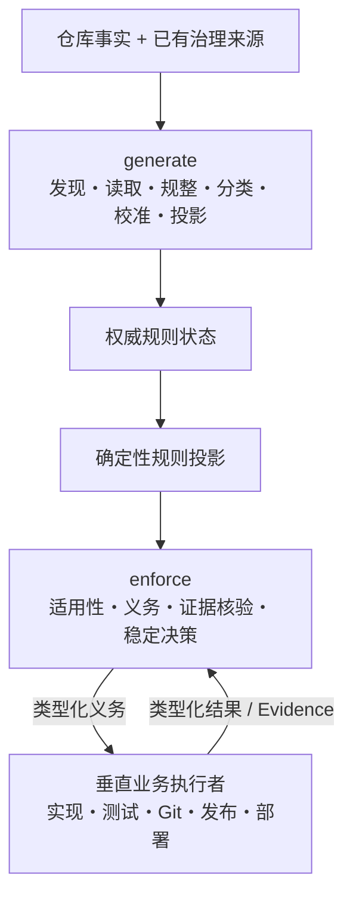

# Harness 2-2-4 治理模型白皮书

## 摘要

Harness 用三条正交轴表达仓库治理：

```text
2 Audience（适用方）
× 2 Responsibility（治理职责）
× 4 Governance Domain（治理域）
= 16 Cell（治理单元）
```

固定模型解决“谁”“系统承担什么责任”“规则讨论什么”三个问题。仓库规则可以
变化，16 个 Cell 的数量、顺序和值域不变。

模型服务于一个北极星目标：在质量、安全、系统边界和可追溯性等硬约束下，
减少人的认知负担、人工触点、协作等待、机器浪费和返工，使人和机器更快、
更稳定地交付正确结果，并从结果中持续学习。

```text
人机协同效能
= 有效成果
÷（人工注意力 + 机器成本 + 等待时间 + 返工成本）
```

这不是允许速度抵消质量的公式。意图对齐、合理分工、一次做对、有效验证、
顺畅交付和持续学习都必须服从外部硬约束。

## 模型图



calibration（校准）位于 generate 内部。它既不扩展固定轴，也不构成用户可选的
第三种 Responsibility。

## 三条轴

### Audience（适用方）

| 值 | 含义 | 实例 |
|---|---|---|
| `maintainer` | 维护 Harness 规范、机器合同和分发制品的一方 | 修改 `model.py` 并验证发布制品 |
| `consumer` | 在外部仓库使用 Harness 治理规则的一方 | 为业务仓库加载四域规则 |

维护仓库根目录不是 consumer。consumer 行为只在外部或临时仓库运行。

### Responsibility（治理职责）

| 值 | 含义 | 实例 |
|---|---|---|
| `generate` | 从事实与治理来源生成、读取、规整、分类、校准并投影规则 | 从 Python 项目元数据派生实现规则候选 |
| `enforce` | 脚手架内部建立保障义务并核验外部证据 | 核验测试 Worker 的结果是否满足 verification 规则 |

`validate` 模型结构只是内部一致性检查，不再等同于 `enforce`。

`generate` 的最低保障是：只使用权威来源或可证明事实，确定性地发现、读取、
规整、分类、校准和投影；缺少关键输入、来源冲突或语义不足时阻断而不是猜测。
`enforce` 的最低保障是：先确定适用性，再建立类型化义务并核验覆盖完整性和
Evidence（证据）充分性；单个 `passed=true` 不能构成满足结论。

### Governance Domain（治理域）

| 值 | 核心不变量 | 最低保障实例 |
|---|---|---|
| `specification` | 为适用范围和版本确定唯一权威规格关系，不创建第二份可编辑规则 SSOT | API Schema 与文档冲突时按已声明优先级裁决；没有优先级则阻断 |
| `implementation` | 满足完整、可追溯的适用设计约束，且不越过系统和契约边界 | 第五个 CLI 命令即使测试通过，也因违反四命令边界而阻断 |
| `verification` | 按场景、实际影响范围和风险选择覆盖全部受影响边界与用户承诺的最低有效验证 | 局部纯函数选单元测试；模块间契约至少加入集成测试 |
| `delivery` | 精确治理环境、生命周期转换、制品、准入、追溯和回滚 | 生产环境重新核对制品摘要、生产门禁和回滚条件 |

治理域不是强制顺序执行的流水线阶段。`scope`（规则适用范围）与
`impact_scope`（本次变化的实际影响范围）不同；环境是 delivery 的内部维度，
Gitflow 是生命周期策略，不是第五个治理域。

## 四域的 generate / enforce 合同

| Domain | `generate` 最低产物 | `enforce` 最低义务与证据 |
|---|---|---|
| `specification` | 权威来源、优先级、范围、版本/摘要和冲突结果 | 绑定当前规格并证明所有适用要求的符合性 |
| `implementation` | 约束来源、类型、范围、摘要、系统边界、接口和数据契约 | 每条适用约束都有实现证据，且无契约违反或越界 |
| `verification` | 需求场景、实际影响和风险推导的最低验证集合及覆盖映射 | 每项必需验证具有步骤、断言、结果、可重复证据和完整覆盖结论 |
| `delivery` | “目标环境 × 生命周期阶段 × 制品 × 准入门槛”合同及前置、追溯、回滚要求 | 正确制品在正确环境和阶段满足全部门禁，并可追溯、可回滚 |

最低有效验证同时防止两类浪费：

| 失败模式 | 例子 | 正确处理 |
|---|---|---|
| 验证不足 | 模块间契约变化只有无关单元测试通过 | 加入覆盖受影响消费者的集成验证 |
| 过度验证 | 局部纯函数变化无条件运行全部端到端和性能测试 | 只选择影响与风险证明必要的验证 |

稳定决策只有四种最低语义：

| 决策 | 含义 |
|---|---|
| `not_applicable` | 当前规则不适用于事件 |
| `blocked` | 必要输入、义务或充分证据缺失、冲突、失败或不完整 |
| `stale` | 规则、revision、影响范围、环境或制品已经变化 |
| `satisfied` | 全部适用义务都有匹配当前上下文的充分证据 |

没有发现违规不等于 `satisfied`。

## 治理强度保障模型

治理强度是规则内部属性，不增加模型轴：

```text
有效治理强度
= max（规则设定等级，事件风险下限，外部硬约束下限）
```

| 等级 | 最低保障 | 典型实例 |
|---|---|---|
| L1 | 自动核验局部证据，信息充分时默认放行 | 私有纯函数 |
| L2 | 自动影响分析和跨模块定向证据 | 内部接口、架构依赖 |
| L3 | 全部必需证据门禁；封闭绑定确认一次 | 公共 API、数据契约 |
| L4 | 完整证据、逐事件授权、环境/制品门禁和必要回滚 | 生产、不可逆、安全边界 |

L0/advisory 不属于 enabled 规则，不能绕过 enforcement。用户可以提高等级，但
不能降到事件或外部硬约束下限以下。

add/update 时，系统先依据可追溯事实推荐等级，展示推荐理由、保障效果、人工交互
和验证成本；用户确认一次或选择允许范围内的其他等级。最终等级和理由绑定
Operation、payload digest、rule revision 与 history，绑定不变时自动执行保障。

enforce 在相同四个 Governance Domain 上选择一种交互模式：

| 模式 | 含义 |
|---|---|
| 默认放行 | 无需新增权限时自动推进，但不跳过 Evidence |
| 确认一次 / 不重复确认 | 封闭绑定不变时只确认一次 |
| 澄清请求 | 补充会改变结果的最少信息，不授予权限 |
| 明确确认 | 对生产、外部、不可逆或高风险具体事件逐次授权 |

一次确认至少绑定 rule_id、revision、domain、scope、事件类别、风险上限和外部性；
明确确认绑定当前 event、target、payload digest、风险和副作用。模式与
`satisfied`、`blocked`、`not_applicable`、`stale` 决策正交。例如，默认放行的
单元测试失败仍是 `blocked`；明确确认的生产发布缺少回滚能力也仍是 `blocked`。

## 规则如何映射到 Cell

假设 consumer 有一条 verification 规则：

```text
rule_id = contract-tests
revision = 3
domain = verification
```

它关联两个固定视图：

```text
consumer.generate.verification  ─┐
                                  ├─ 同一 rule_id / revision
consumer.enforce.verification   ─┘
```

- generate 视图证明规则来自当前事实或已有治理来源，并进入当前投影；
- enforce 视图引用同一 revision 的执行保障合同；
- 两个视图不会复制规则，也不会改变 Cell 数量；
- consumer 规则不会写入任何 `maintainer.*` Cell。

状态与映射关系如下：

| 规则情况 | generate/enforce 当前绑定 |
|---|---|
| enabled | 两个视图都绑定当前 revision |
| disabled | 保留身份与历史映射，不进入当前生效集合 |
| deleted | 不属于当前集合，无有效 Cell 绑定 |
| updated | 两个视图切换到新 revision，旧绑定 stale |

具体状态字段由 #51 定义，投影和 stale 行为由 #54 实现。

## 三层边界

```text
用户自然语言
   │
   ▼
Harness Skill ──类型化请求──> Harness 脚手架
                                  │
                                  ├─权威状态 / 投影 / 保障
                                  │
                                  └─义务与证据协议
                                           ▲
                                           │
                                  垂直业务执行者
```

正例：Skill 把“停用 contract-tests”解析为 disable 请求。

反例：Skill 看到 verification 规则后直接运行 `pytest`。运行测试属于垂直业务
执行者，不属于 Skill。

正例：脚手架核验外部提交的测试证据并返回 `satisfied` 或 `blocked`。

反例：脚手架把聊天中的“测试已通过”当成权威证据。

## 权威性与确定性

consumer 规则状态是 SSOT；投影和 enforcement 状态都是派生结果。相同仓库快照、
治理来源和类型化请求必须产生相同结果。事实、规则或 revision 改变后，旧投影及
旧证据必须失效。

这一关系避免三类常见错误：

| 错误 | 后果 | 模型处理 |
|---|---|---|
| 把投影当成第二份可编辑规则 | 两份规则互相漂移 | 投影只从权威状态重算 |
| 把 Skill 当业务执行器 | 治理接口越权 | Skill 只提交类型化请求 |
| 把 Schema 校验当执行保障 | 规则只是静态文字 | enforce 必须产生可观察义务与决策 |

完整规范见 [specification.md](specification.md)。治理效能重基线的计划、状态与
验收见 [GitHub Epic #59](https://github.com/bigsmartben/harness-scaffold/issues/59)
及 F0 [#60](https://github.com/bigsmartben/harness-scaffold/issues/60)；已发布的
`4.0.0` 在后续合同、迁移、运行时和分发完成版本闭环前仍是唯一生效合同。
