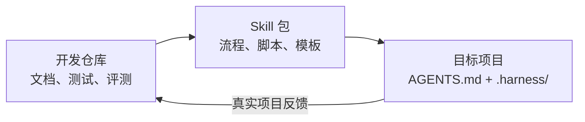
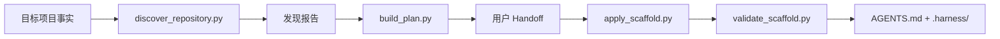
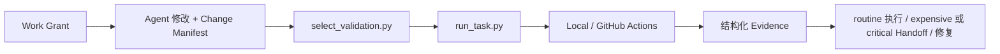

# AI Coding Harness 仓库结构

版本：`0.3.0`
状态：P0–P4 Available；P5 In Progress
最后更新：2026-07-24

本文定义三个不同物理层的文件边界：

1. 当前开发仓库：开发、验证和发布 Harness。
2. 可安装 Skill 包：交付给 Codex 的最小运行资产。
3. 目标项目：被 Adopt 或 Bootstrap 后得到的项目级 Harness 配置。

行为政策只由 [`specification.md`](specification.md) 定义，本文只说明政策应该存放在哪里。

## 目录

- [1. 三层结构](#1-三层结构)
- [2. 当前 0.3 结构](#2-当前-03-结构)
- [3. 完整开发仓库结构](#3-完整开发仓库结构)
- [4. Skill 包结构](#4-skill-包结构)
- [5. 目标项目结构](#5-目标项目结构)
- [6. 文件职责与事实源](#6-文件职责与事实源)
- [7. 数据流](#7-数据流)
- [8. 结构约束](#8-结构约束)

## 1. 三层结构



| 层级 | 受众 | 内容 | 不应包含 |
|---|---|---|---|
| 开发仓库 | 维护者、贡献者 | 规范、用例、路线、测试、评测、Skill 源码 | 目标项目的临时运行日志 |
| Skill 包 | Codex Agent | `SKILL.md`、UI 元数据、确定性脚本、按需引用、输出模板 | README、Quickstart、Changelog、开发历史 |
| 目标项目 | 项目 Agent、维护者、CI Backend | 轻量入口、工具索引、写边界、任务、影响、Git Remote Push Adapter 与 Pipeline 配置 | Harness 开发仓库的测试、评测和设计历史 |

开发仓库和 Skill 包是“产品源码与发布物”的关系；目标项目是 Skill 的输出，不是 Skill 本身。

## 2. 当前 0.3 结构

当前仓库已经完成规范、Schema、Validator、执行层和 Skill 的 0.3 重基线：

```text
harness/
├── AGENTS.md
├── README.md
├── uc.md
├── plan.md
├── .harness/
├── docs/
├── skills/initialize-ai-coding-harness/
├── tests/
└── evals/
```

P0–P4 的本地验收资产已经存在。P4 采用本地产品验收；真实 GitHub Evidence 在具体正式交付时作为运行时门禁。目标项目还会生成窄化的 Git Remote Adapter：例如确认 `origin + refs/heads/codex/demo + <commit>` 后只允许一次非强推 Push。P5 已确认私有发布渠道和当前用户安装目标，正在准备安装与发布。

## 3. 完整开发仓库结构

以下结构是 0.3 开发仓库的职责边界；阶段状态以 [`plan.md`](../plan.md) 为准：

```text
harness/
├── AGENTS.md
├── README.md
├── uc.md
├── plan.md
├── pyproject.toml
├── uv.lock
├── .gitignore
│
├── docs/
│   ├── specification.md
│   ├── repository-structure.md
│   └── quickstart.md
│
├── .harness/
│   ├── harness.yaml
│   ├── boundaries.yaml
│   ├── tools.yaml
│   ├── tasks.yaml
│   ├── impact.yaml
│   ├── pipelines/
│   │   ├── merge.yaml
│   │   └── publish.yaml
│   ├── adapters/
│   └── .gitignore
│
├── skills/
│   └── initialize-ai-coding-harness/
│       ├── SKILL.md
│       ├── agents/
│       │   └── openai.yaml
│       ├── scripts/
│       │   ├── discover_repository.py
│       │   ├── build_plan.py
│       │   ├── approve_plan.py
│       │   ├── apply_scaffold.py
│       │   ├── validate_scaffold.py
│       │   ├── select_validation.py
│       │   ├── run_task.py
│       │   ├── evaluate_pipeline.py
│       │   └── harness_core/
│       ├── references/
│       │   ├── core-model.md
│       │   ├── tool-registry.md
│       │   ├── delivery-model.md
│       │   ├── adopt-existing-project.md
│       │   └── bootstrap-new-project.md
│       └── assets/
│           ├── scaffold/
│           ├── schemas/
│           └── backends/
│               ├── local/
│               └── github-actions/
│
├── tests/
│   ├── unit/
│   ├── integration/
│   ├── fixtures/
│   │   ├── empty-project/
│   │   ├── existing-github-actions/
│   │   ├── python-project/
│   │   ├── node-project/
│   │   └── monorepo/
│   └── snapshots/
│
└── evals/
    ├── cases/
    │   ├── bootstrap-empty-project.md
    │   ├── adopt-existing-ci.md
    │   ├── avoid-unnecessary-full-ci.md
    │   └── registry-is-not-authorization.md
    └── rubrics/
        └── harness-quality.md
```

### 3.1 根目录

| 路径 | 职责 |
|---|---|
| `README.md` | 产品入口、能力概览、成熟度和文档导航 |
| `uc.md` | 用户可观察行为与验收索引 |
| `plan.md` | 实施阶段、依赖、状态和阶段验收 |
| `pyproject.toml`、`uv.lock` | Python 3.12 开发和测试环境 |
| `.harness/` | 本仓库自用的 0.3 配置与影响规则 |
| `AGENTS.md` | 当前仓库的轻量 Harness 入口 |

### 3.2 测试与评测

`tests/` 验证确定性 Python 和配置契约；`evals/` 验证 Skill 是否驱动 Agent 表现出预期行为。

示例：

- `tests/fixtures/existing-github-actions/` 验证 Adopt 不改写已有 Workflow。
- `evals/cases/avoid-unnecessary-full-ci.md` 验证 Agent 完成局部修改后不会自行运行全量 CI。

两者不能互相替代：脚本通过单元测试，不代表 Skill 指令能约束真实 Agent；Agent 评测通过，也不代表 Schema 和执行器确定正确。

## 4. Skill 包结构

最终 Skill 名称固定为 `initialize-ai-coding-harness`。P2 先提供初始化、接管、更新和审查；P3 在同一 Skill 中增加 Work、Verify、Merge 和 Publish 路由，保证 README 与 Quickstart 描述的完整体验有唯一用户入口。

```text
skills/initialize-ai-coding-harness/
├── SKILL.md
├── agents/
│   └── openai.yaml
├── scripts/
├── references/
└── assets/
```

### 4.1 `SKILL.md`

只保留核心流程：

```text
识别用户意图
  → 只读发现
  → P2：选择 Adopt / Bootstrap / Audit / Update
  → P3：选择 Work / Verify / Merge / Publish
  → 生成适用的 Plan 或执行意图
  → 必要时 Handoff
  → 按 CI/CD 自动化等级执行 routine Task 或生成待确认 Request
  → 校验并报告 Evidence
```

详细领域规则放入 `references/`，模板和 Schema 放入 `assets/`，可重复且易错的动作放入 `scripts/`。`SKILL.md` 不复制完整 Harness 规范。

### 4.2 `agents/openai.yaml`

提供 Skill 列表所需的展示名称、简短说明和默认提示。该文件必须由 Skill 内容确定性生成，并在 Skill 变更后重新校验。

### 4.3 `scripts/`

Python 3.12 是内部确定性执行层，首版不作为独立公共 CLI 发布。

| 脚本 | 单一职责 |
|---|---|
| `discover_repository.py` | 只读发现项目事实并输出来源 |
| `build_plan.py` | 将发现结果转换为 Adopt、Bootstrap、Audit 或 Update Plan |
| `approve_plan.py` | 创建只绑定当前 Plan digest 的独立 Approval |
| `apply_scaffold.py` | 只应用已确认计划中的文件变更 |
| `validate_scaffold.py` | 执行 Schema 和跨文件校验 |
| `select_validation.py` | 根据 Diff 与 Impact Rules 选择最低充分验证集 |
| `run_task.py` | 调度已选择 Task 并生成 Evidence |
| `evaluate_pipeline.py` | 只执行 readiness 或使用既有 Platform Evidence finalize |
| `validate_platform.py` | 检查 GitHub 凭证隔离、Required Checks、Protected Environment 与受控触发事实 |
| `harness_core/` | 共享模型、解析、错误码和跨平台执行代码 |

脚本使用 `pathlib` 处理路径，使用参数数组调用子进程，避免依赖 Bash 或 PowerShell 特有语法。

### 4.4 `references/`

References 只在相关流程触发时加载：

- Adopt 时读取 `adopt-existing-project.md`。
- Bootstrap 时读取 `bootstrap-new-project.md`。
- 工具发现或登记时读取 `tool-registry.md`。
- 验证、Merge 或 Publish 时读取 `delivery-model.md`。
- 核验 GitHub 正式交付权限时读取 `github-platform-gates.md`。

每个 Reference 由 `SKILL.md` 直接链接，不建立多层引用链。

### 4.5 `assets/`

| 目录 | 职责 |
|---|---|
| `scaffold/` | 复制或渲染到目标项目的 `AGENTS.md` 和 `.harness/` 模板 |
| `schemas/` | YAML 解析后的 JSON Schema；是配置结构的机器契约 |
| `backends/local/` | Local Task Backend 模板 |
| `backends/github-actions/` | GitHub Actions Adapter 与新项目 Workflow 模板 |

Schema 的规范语义来源仍是 [`specification.md`](specification.md)。Schema 只负责机器可检查的结构，不创建新政策。

## 5. 目标项目结构

Adopt 或 Bootstrap 完成后的目标项目结构为：

```text
target-project/
├── AGENTS.md
└── .harness/
    ├── harness.yaml
    ├── boundaries.yaml
    ├── tools.yaml
    ├── tasks.yaml
    ├── impact.yaml
    ├── pipelines/
    │   ├── merge.yaml
    │   └── publish.yaml
    ├── adapters/
    ├── .gitignore
    ├── runs/
    ├── reports/
    └── cache/
```

### 5.1 `AGENTS.md`

目标项目的 `AGENTS.md` 是轻量入口，只说明：

- 在哪里读取 `.harness/`。
- 普通工具如何查询 Registry。
- CI/CD 动作按语义解析到 Task，不由 Shell、CLI、MCP 或 API 通道决定。
- 只有显式允许的 `routine` Task 可自动执行；`expensive` 和 `critical` 必须 Handoff。
- Push、Merge、Publish、Release 和 Deploy 每次确认，正式权限由 CI/CD 平台门禁提供。

详细规则不得复制进 `AGENTS.md`，避免入口文件与规范或配置漂移。

Adopt 时若 `AGENTS.md` 已存在，模板不是替换源。Harness 只能在用户确认合并 Diff 后加入上述轻量入口，并必须保留原有项目指令。

### 5.2 已提交配置

| 路径 | 内容 |
|---|---|
| `harness.yaml` | Schema 版本、项目模式、现有事实源引用 |
| `boundaries.yaml` | 默认写边界及扩张处理 |
| `tools.yaml` | 工具与动作索引；`managed` 条目引用 `tasks.yaml`，不含身份授权 |
| `tasks.yaml` | CI/CD Task、自动化等级、自动允许状态与 Backend |
| `impact.yaml` | 变更范围到验证集合的映射 |
| `pipelines/merge.yaml` | Merge 每次确认与 Required Checks 门禁 |
| `pipelines/publish.yaml` | 独立 Publish 确认与 Protected Environment 门禁 |
| `adapters/` | 对现有或新建 Backend 的映射 |
| `.gitignore` | 排除 `runs/`、`reports/` 和 `cache/` |

`tools.yaml` 以能力或动作而非整个二进制为条目粒度。例如，同一个 `python` executable 应分别拥有只读分析的 `direct` 条目和引用 `test:python` 的 `managed` 测试条目。

### 5.3 未提交运行数据

`runs/`、`reports/` 和 `cache/` 必须被 `.harness/.gitignore` 排除。需要长期保存的 Evidence 应由项目配置的制品或审计后端接管，而不是无界增长在 Git 中。

## 6. 文件职责与事实源

| 事实 | 唯一事实源 | 其他文件如何使用 |
|---|---|---|
| Harness 政策 | `docs/specification.md` | UC、Quickstart 和 Skill 引用规则编号 |
| 用户可观察行为 | `uc.md` | 测试和评测引用 `UC-*` |
| 实施状态 | `plan.md` | README 和 Quickstart 投影状态 |
| Runtime 版本 | 目标项目已有版本文件 | `tools.yaml` 保存引用而非复制事实 |
| 已有 CI/CD 实现 | 目标项目 Workflow 或脚本 | Adapter 和 Task 保存引用 |
| 配置结构 | Skill `assets/schemas/` | Validator 读取并执行 |
| Skill 流程 | `SKILL.md` | `agents/openai.yaml` 提供 UI 投影 |

同一事实不得在多个位置独立维护。例如，Python 版本来自 `pyproject.toml` 时，`tools.yaml` 应记录事实源路径，而不是维护另一个可能漂移的版本号。

## 7. 数据流

### 7.1 初始化或接管



### 7.2 日常执行



## 8. 结构约束

以下结构属于禁止项：

- 在 Skill 包中放置 README、Quickstart、Changelog 或开发计划。
- 在目标项目中复制 Harness 开发仓库的测试、评测或设计历史。
- 在 `tools.yaml` 放置 Agent / Skill 身份授权矩阵。
- 在 `AGENTS.md` 复制完整规范。
- 在 Adapter 中复制已有 Workflow 的实现并把副本作为新事实源。
- 同时维护两套 Schema、模板或 blocker code 定义。
- 将运行日志和缓存提交到 Git。
- 把 Planned 或 In Progress 阶段描述成已经通过真实平台或发布验收。
