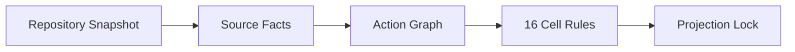

# Harness 2.0 规范

版本：`2.0.0`

## 1. 产品边界

Harness 是仓库脚手架，不是常驻 Agent 平台。公共闭环是：

```text
uv tool install → sdd-harness init → repository Skill → Codex App / CLI
  → $harness projection plan/apply
```

Python Core 是唯一确定性权威。Skill 解释工作流；Hook、Plugin、MCP 只提供可选
加固，并通过 PATH 上的 `sdd-harness` 和 JSON 契约调用 Core。

## 2. 公共契约

| 契约项 | 规则 | 失败语义 |
|---|---|---|
| 输入 | 仓库快照、来源事实、版本化项目策略 | 来源缺失时失败关闭 |
| 输出 | Action Graph、16 Cell Projection、Coverage、精确动作结果 | Schema 或摘要不符不得接受 |
| 边界 | 模型可解释与修改业务代码，但不能生成权威 Projection、Coverage、Gate Decision | 返回稳定 blocker code |
| 版本 | Core、Schema、Skill 必须都是 `2.0.0` | `HARNESS_RUNTIME_INCOMPATIBLE` |

### 2.1 四域

每个 Action 只有一个主域：

| Domain | Action 实例 |
|---|---|
| `specification` | 更新需求、生成 Issue Plan |
| `implementation` | 编辑源码、代码生成、Build |
| `verification` | Test、类型检查、契约验证、CI |
| `delivery` | Commit、Remote Issue、Push、PR、Merge、Release |

### 2.2 16 Cell

Cell ID 固定为：

```text
<audience>.<responsibility>.<domain>
```

其中 Audience 为 `maintainer | consumer`，Responsibility 为
`generate | enforce`。每个 Cell 独立包含来源、单一 directive、scope、
可空 action binding、前后置条件、Evidence、失败语义和 Coverage。

Coverage 机器枚举只有：

```text
missing | documented | verified | enforced | not_applicable
```

若展示 C0–C4，它们只能是固定别名，不能参与判断。`not_applicable` 必须同时有
来源和理由；缺失、重复、无来源 N/A 都返回
`GOVERNANCE_COVERAGE_INCOMPLETE`。

## 3. 确定性编译



`projection_id` 绑定 Snapshot、Facts、Action Graph、项目策略、Schema 和编译器
版本。项目策略、Issue 配置或治理来源变化后，旧投影和旧本次决定立即失效。
版本化 Snapshot 只记录仓库相对来源路径及内容摘要；绝对工作区路径、当前分支
和运行时工作区摘要不进入投影。因此同一 Commit 在不同私有分支或克隆目录中
保持同一投影，分支与工作区变化仍由本次决定独立绑定。

## 4. 项目策略与本次决定

项目策略写入版本化 `.harness/harness.yaml`，包含本地执行、最低充分验证、
Issue Provider、Hook 选项和分支边界。

本次决定只写入被 Git 忽略的 `.harness/runtime/<task_id>/decision.json`，并绑定：

```text
task_id + projection_id + workspace_digest + exact_action + target_digest
```

新任务、投影变化、工作区变化或精确目标变化都会使决定失效。Commit、Remote
Issue、Push、PR 分别需要决定，不得扩散授权。

## 5. 本地工作与 T0–T3

普通本地修改不逐工具询问。选择器按变化面给出最低验证：

- T0：文档、只读检查；
- T1：单个窄实现或测试；
- T2：公共 Schema、组件级或多文件变化；
- T3：Core、依赖、安全、CI/CD。

Action Graph 可提高验证下限，但不能降低由路径影响得到的层级。

## 6. Commit、Issue 与受控边界

Commit Planner 分离 Workspace Impact Scope 与 Commit Scope。执行器使用临时 Git
Index 提交确认路径；无关暂存保持不变。目标文件部分暂存且无法保持分块语义时
阻断，不扩大为整文件。

Local Issue 和 Remote Issue 共用 Issue Plan：

- Consumer 默认写 `.harness/issues`；
- Maintainer 可把 GitHub 配成唯一 SSOT；
- 远端写入失败不回退本地。

Private Branch 可直接进行仓库内动作。Controlled 或 Unclassified Branch 的写入、
Commit、Issue Write 和交付动作返回 `CONTROLLED_BRANCH_GATE_REQUIRED` 与
`HANDOFF_REQUIRED`，并要求上游平台门禁。

PR、Merge、Publish、Release、Deploy 使用同一受控交付契约：

```text
精确目标 + 平台门禁 Evidence
  → Delivery Plan
  → 绑定 action_id / projection / workspace / target 的本次决定
  → Provider Request
  → Provider Receipt
  → Evidence 校验
```

平台门禁必须来自独立查询并绑定 `action_id + provider + repository +
target_digest`。缺失或摘要不符返回 `PLATFORM_GATE_REQUIRED`；Provider 失败返回
`REMOTE_DELIVERY_FAILED`，不得回退到其他目标。

## 7. 初始化与版本边界

新仓库使用 `sdd-harness init .`；自动化可使用 `--yes`，也可用
`--approve-plan <plan_digest>` 接受一份未变化的精确计划。该命令只发布
`AGENTS.md`、仓库 Skill、项目配置和忽略规则，不生成治理投影。第二阶段必须由
仓库 `$harness` 先识别 Blue / Gray，再以独立计划生成 5 个投影文件。

Harness 2.0 不提供历史版本兼容、字段映射或迁移工具。目标仓库存在非 2.0
配置时，初始化必须零写入返回 `HARNESS_RUNTIME_INCOMPATIBLE`。无效的 2.0 配置
返回 `CONFIG_INVALID`，不得静默替换。

## 8. 完成定义

只有 Core / Schema / Skill 版本一致、投影摘要有效、16 Cell 各一条、Action
绑定唯一、当前分支与精确决定有效、最低验证和必要平台 Evidence 完整时，Harness
才能声明对应结果成立。
