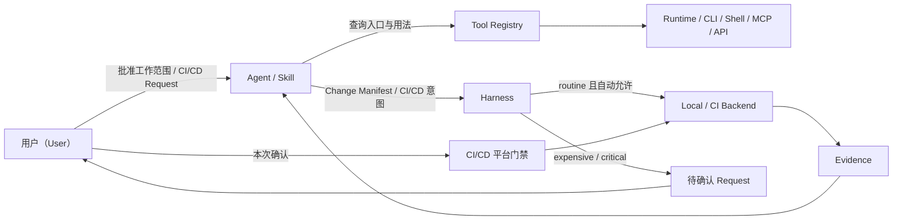

# AI Coding Harness 规范

版本：`0.2.0`  
状态：P3 Available（`0.2` 权限模型）  
最后更新：2026-07-24

本文是 AI Coding Harness 的唯一规范来源（Normative Specification）。其他文档负责解释、演示或规划，不得改变本文定义的职责边界与行为规则。

## 目录

- [1. 规范语言与文档关系](#1-规范语言与文档关系)
- [2. 目标与问题定义](#2-目标与问题定义)
- [3. 术语与参与者](#3-术语与参与者)
- [4. 总体模型与职责边界](#4-总体模型与职责边界)
- [5. 工作区写边界规则](#5-工作区写边界规则)
- [6. 工具注册表规则](#6-工具注册表规则)
- [7. 交付管理规则](#7-交付管理规则)
- [8. Handoff 与确认规则](#8-handoff-与确认规则)
- [9. Evidence 与失败规则](#9-evidence-与失败规则)
- [10. 项目生命周期](#10-项目生命周期)
- [11. 目标项目配置契约](#11-目标项目配置契约)
- [12. 自动化等级与平台门禁](#12-自动化等级与平台门禁)
- [13. 验收基线](#13-验收基线)

## 1. 规范语言与文档关系

### 1.1 规范关键词

本文使用以下关键词表达约束强度：

- **MUST / 必须**：实现和使用者必须满足。
- **MUST NOT / 禁止**：实现和使用者不得执行。
- **SHOULD / 应该**：除非存在明确、可记录的理由，否则应满足。
- **MAY / 可以**：属于兼容的可选行为。

### 1.2 文档职责

| 文档 | 唯一职责 |
|---|---|
| 本文 | 定义规范规则、状态、失败语义和配置职责 |
| [`uc.md`](../uc.md) | 把规则投影为用户可观察、可验收的用例 |
| [`repository-structure.md`](repository-structure.md) | 定义开发仓库、Skill 包和目标项目的物理边界 |
| [`quickstart.md`](quickstart.md) | 演示最终用户路径，不创建新政策 |
| [`README.md`](../README.md) | 提供产品入口、能力概览和文档导航 |
| [`plan.md`](../plan.md) | 记录实施阶段、依赖、状态和阶段验收 |

出现冲突时，以本文为准。未来的 YAML Schema 和验证器必须实现本文规则，不得自行扩展政策；若 Schema、验证器与本文不一致，系统必须返回 `CONFIG_INVALID` 或 `EVIDENCE_INCOMPLETE`，不得猜测哪一方正确。

## 2. 目标与问题定义

### 2.1 目标

AI Coding Harness 是项目工作区、工具发现与 CI/CD 交付执行的统一控制层。它的目标是：

1. 让 Agent / Skill 在已批准的路径内自由实现，并在计划或检查中发现写入范围扩散。
2. 为 Agent / Skill 提供确定的 Runtime、CLI、Shell、MCP、API 和项目能力索引，消除工具发现与调用试错。
3. 按动作语义统一管理 Test、Build、CI、Push、Merge、Publish、Release 和 Deploy，选择最低充分验证集，并执行三级自动化策略。
4. 以结构化 Evidence 返回执行结论，避免完整日志直接污染 Agent 上下文。

### 2.2 要解决的问题

| 问题 | 典型表现 | Harness 的处理 |
|---|---|---|
| 写入范围扩散 | 局部任务顺手重构、格式化或修改无关文件 | 声明写边界；扩张时停止并 Handoff |
| 工具调用试错 | 反复尝试 Python、`rg`、MCP Server 名称和参数 | 提供项目工具注册表 |
| 过度验证 | 小改动执行全量 Build、Test 或 CI | Harness 选择最低充分验证集 |
| 日志消耗 | 数万行构建日志进入 Agent 上下文 | 保留完整日志，只返回摘要与定位信息 |
| 交付入口分散 | Workflow、Shell、CLI、MCP、API 各自为入口 | 按 CI/CD 动作语义映射为统一 Task Catalog 和 Request |

### 2.3 非目标

Harness MUST NOT 负责：

- 定义产品意图或业务规则。
- 替代架构设计、领域建模或测试用例设计。
- 管理垂直 Agent / Skill 的 Prompt、推理步骤、任务分解或实现策略。
- 重写编译器、测试框架、CI Runner 或部署平台。
- 对每次普通工具调用执行统一授权、审批或代理转发。
- 强制拦截普通 MCP、网络、Shell、Runtime、CLI 或本地文件写入。
- 建设通用宿主强制根、完整进程中介或 Agent 身份授权系统。
- 在没有来源事实时推断项目技术栈、版本、命令或交付策略。

## 3. 术语与参与者

| 术语 | 定义 | 示例 |
|---|---|---|
| 用户（User） | 批准工作范围及需确认 CI/CD 动作的人 | 仓库维护者 |
| Agent | 在工作区内分析和修改项目的执行主体 | Codex 编码 Agent |
| Skill | 为 Agent 提供垂直流程或领域能力的可复用包 | Figma 实现 Skill |
| Harness | 维护边界、工具索引、交付选择和 Evidence 的控制层 | 本项目计划实现的 Skill 与 Python 执行层 |
| 普通能力（Ordinary Capability） | Registry 提供入口和使用指导、且不命中 CI/CD 交付语义的能力 | `rg`、Python 分析、普通 MCP Tool |
| CI/CD Task | 按动作语义进入 Delivery Management 的任务 | Unit Test、Build、Merge、Publish |
| `routine` | 项目明确允许后可自动执行的低成本常规 CI/CD Task | 快速 Unit Test |
| `expensive` | 每次执行前必须确认的高成本 CI/CD Task | Integration、E2E、Full CI、大型 Build |
| `critical` | 每次执行前必须确认，并由平台门禁决定正式权限的关键动作 | Push、Merge、Publish、Release、Deploy |
| Harness Request | 描述待确认 CI/CD 动作、目标、变更和风险的结构化请求 | Full CI Request、Publish Request |
| 平台门禁（Platform Gate） | CI/CD 平台提供的凭证隔离、Required Checks、Protected Environment 和审批 | GitHub Branch Protection |
| 受保护 Pipeline（Protected Pipeline） | 包含 `expensive` 或 `critical` 动作并受平台门禁保护的 Pipeline | GitHub Actions 发布 Workflow |
| 执行后端（Backend） | 实际运行受控任务的工具或平台 | Local、GitHub Actions、npm、pytest |
| 工作授权（Work Grant） | 用户批准的一次工作意图、写入范围、Merge 目标、验证策略及适用的交付与风险事实 | “低风险修改 `src/order/**` 并合并到当前分支” |
| Handoff | 因范围扩张或需确认 CI/CD 动作而交由用户决定 | Full CI 或 Publish 前确认 |
| Change Manifest | Agent 对当前修改影响的结构化声明 | `changed_paths`、`contract_changed` |
| Evidence | 某次任务执行的结构化结论、定位信息和完整日志引用 | 失败用例、文件行号、报告路径 |
| Adopt | 接管已有项目的工具与 CI/CD 资产，不重建其底层实现 | 映射已有 GitHub Actions |
| Bootstrap | 为没有 CI/CD 的项目建立最小交付体系 | 为 Python 项目创建任务目录 |

## 4. 总体模型与职责边界



Harness 包含三个职责域：

| 职责域 | Harness 负责 | Harness 不负责 |
|---|---|---|
| 工作区写边界（Workspace Boundary） | 声明、检查和升级写入范围 | 宿主级拦截普通文件写入 |
| 工具注册表（Tool Registry） | 注册、索引、说明 Runtime、CLI、Shell、MCP、API 和脚本 | 身份授权、逐次审批或调用代理 |
| 交付管理（Delivery Management） | 按语义分类 CI/CD Task，生成 Request，调度已允许动作并汇总 Evidence | 控制普通工具权限或重写底层 CI/CD 平台 |

普通能力与 CI/CD Task 必须按动作语义保持不同路径；传输通道不改变分类：

```text
普通能力
  → 查询 tools.yaml
  → Agent / Skill 按确定入口直接调用

CI/CD Task
  → 查询 tasks.yaml 与 impact.yaml
  → Harness 计算最低充分集合与自动化等级
  → routine：仅在显式自动允许时调度
  → expensive / critical：生成 Request 并等待本次确认
  → critical：同时经过 CI/CD 平台门禁
  → Harness 返回 Evidence
```

## 5. 工作区写边界规则

### WB-001：显式写入范围

每次工作 MUST 具有可检查的允许写入路径集合。项目默认边界只能用于生成提案；任何写入发生前，Harness MUST 把解析后的具体路径绑定到有效、由用户批准的 Work Grant。

示例：任务允许修改 `src/order/**` 与 `tests/order/**`，不因此获得修改 `src/payment/**` 的权限。

### WB-002：范围内自由与垂直能力隔离

Agent / Skill MAY 在已批准范围内自行选择实现、重构方式和普通工具。Harness MUST NOT 注入垂直 Agent / Skill 的 Prompt、内部步骤、领域判断或代码组织策略。

### WB-003：边界扩张

当计划写入路径超出当前范围时，执行 MUST 停止。Evidence 的 `blocker_codes` MUST 同时包含 `WRITE_SCOPE_EXPANDED` 和 `HANDOFF_REQUIRED`：前者说明停止原因，后者说明下一步状态转换。系统 MUST 提供拟新增路径、扩张原因和受影响任务；不得静默扩大范围。

### WB-004：声明与检查

Harness MUST 在修改前声明边界，并将实际 Diff 与边界比较。它 MUST 明确说明该机制用于计划、检查和 Handoff，不宣称对普通 Shell、MCP、进程或文件写入提供宿主级强制拦截。

### WB-005：权限范围边界

工作区写边界 MUST NOT 被描述为通用 Sandbox、文件 Hook 或完整进程中介。普通工具造成的实际写入仍按 WB-003 和 WB-006 检查；正式 CI/CD 权限只由第 12 节的平台门禁提供。

### WB-006：删除与批量改写

删除、递归移动、批量格式化和代码生成 MUST 使用同一写边界。操作规模超出 Work Grant 时，必须按 WB-003 处理。

## 6. 工具注册表规则

### TR-001：必须注册的能力

所有 Agent / Skill 可见的 Runtime、CLI、Shell、Package Manager、MCP Server、MCP Tool、外部 API 和仓库脚本 MUST 注册到 `tools.yaml`。Registry 只提供确定入口和使用指导。命中 Test、Build、CI、Push、Merge、Publish、Release 或 Deploy 语义的动作还 MUST 注册到 `tasks.yaml`，并从工具条目引用对应 Task。

### TR-002：工具条目最小信息

Registry 条目代表一个可调用能力或动作，不代表整个 executable 或 Tool 的全部语义。同一入口承载普通动作和 CI/CD 动作时，MUST 建立独立条目；例如 `python-read-analysis` 可以是 `direct`，`python-project-tests` 必须是引用 `test:python` 的 `managed` 条目。

每个工具条目 MUST 说明：

- 稳定 ID、类型和用途。
- 版本或版本事实源。
- 确定入口与工作目录；`managed` 条目以 `task_ref` 作为调用入口。
- 适用场景和不适用场景。
- 输入、输出和项目特定约束。
- 对应的能力名称，例如 `repository-search`。
- `invocation_mode`：`direct` 或 `managed`。
- 当 `invocation_mode` 为 `managed` 时，必须提供 `task_ref`。

示例：`repository-search` 映射到 `rg`，并给出项目根目录下的典型调用，而不是只记录“rg 已安装”。

### TR-003：MCP 索引粒度

MCP MUST 同时注册 Server 和可调用 Tool。仅记录 Server 名称不足以让 Agent 确定完成某个动作应调用哪个 Tool。

### TR-004：注册不等于授权

Tool Registry MUST NOT 成为普通工具的身份授权矩阵、逐次审批器、调用代理或转发网关。配置 MUST NOT 包含基于 Agent / Skill 身份的 `allowed_agents`、`denied_agents` 或等价授权列表。普通 Shell、CLI、MCP、API 或 Runtime 动作不能只因通道类型而进入审批。

Handoff 只适用于工作范围与交付状态转换，不得被解释为普通工具逐次授权。

### TR-005：普通工具直接调用

Agent / Skill 在条目的 `invocation_mode` 为 `direct`，且具体动作不匹配任何 CI/CD Task 语义时，MAY 按条目直接调用，无需让 Harness 转发或逐次确认。调用产生的文件写入仍受 WB 系列规则约束。

同一 executable MAY 同时承载两种动作，但必须以不同能力条目表达。例如 Python 用于只读分析时是 `direct`，用于项目级 Test 时是绑定 `task_ref` 的 `managed`。一旦调用语义命中 DM-001，DM 系列规则优先；注册 executable 不等于允许直接执行其所有参数组合。

### TR-006：缺失或失效的注册项

当所需能力未注册、入口不存在或版本事实源无法解析时，Agent / Skill MUST 停止猜测式调用并返回 `TOOL_NOT_REGISTERED` 或 `TOOL_ENTRY_STALE`，说明所需能力与已检查事实。

### TR-007：避免重复事实源

Registry SHOULD 引用项目已有的版本或任务事实源，例如 `.python-version`、`pyproject.toml`、`.nvmrc`、`package.json` 或 Gradle Wrapper。Registry 不应复制一个会独立漂移的版本值。

### TR-008：Task 内部工具链

CI/CD Task 内部调用的编译器、Runner 和子进程 MAY 由 Task Backend 封装，无需作为 Agent 可见工具逐项暴露。若 Agent / Skill 需要直接调用其中某项能力，则该能力重新适用 TR-001。

## 7. 交付管理规则

### DM-001：CI/CD Task 范围

命中 Test、Build、CI、Push、Merge、Publish、Release 或 Deploy 语义的动作 MUST 注册为 CI/CD Task，并通过 Harness 分类、选择或形成 Request。其他动作默认由 Registry 提供调用引导，不进入 Delivery Management。

分类 MUST 由动作语义决定，不由 Shell、CLI、Runtime、MCP 或 API 等调用通道决定。例如 `python -m pytest`、`npm test` 和 `github.create_release` 分别命中 Test 或 Release；普通 Python 分析、仓库搜索或读取 MCP Tool 不因此受控。

### DM-002：修改权与验证决策权分离

Agent / Skill MAY 提交 Change Manifest 和推荐检查，但 MUST NOT 自行决定最终验证集合。Harness MUST 结合实际 Diff、模块或依赖事实、公共契约变化和 `impact.yaml` 计算最终集合。

### DM-003：最低充分验证

默认验证级别 MUST 是能够覆盖当前已知影响的最低级别，而不是 `full`。支持的语义级别为：

| 级别 | 使用场景 | 典型任务 |
|---|---|---|
| `inspect` | 文档或无运行时影响的配置 | 格式、链接、静态结构检查 |
| `affected` | 单模块内部修改 | 受影响模块 Lint、类型检查、单测 |
| `contract` | 公共 API、协议或数据结构变化 | 契约测试及直接依赖方测试 |
| `integration` | 跨模块或跨服务变化 | 必要集成路径 |
| `full` | 明确触发全量条件 | 完整关键 CI |
| `publish` | 正式外部交付 | 制品与发布验证 |

验证级别描述“需要验证到哪里”，自动化等级描述“是否可以自动启动”，两者 MUST 分开计算。例如规则可以推荐 `full`，但对应 Task 是 `expensive`，因此未确认时只能生成 Request。

### DM-004：全量验证升级条件

只有以下事实之一成立时，Harness MAY 选择 `full`：

- Harness 或 CI 配置发生影响执行语义的变化。
- 构建系统、核心依赖或 Lockfile 发生广泛变化。
- 公共基础模块或跨系统架构发生变化。
- 用户明确要求全量验证。
- 当前项目的 Merge Policy 明确要求。

Agent 的“更安全”偏好本身不是升级条件。

即使允许选择 `full`，Full CI MUST 标记为 `expensive`，没有本次确认时不得启动 Backend。

### DM-005：影响范围不明

当 Harness 无法可靠计算影响范围时，MUST 返回 `IMPACT_UNRESOLVED`，列出缺失事实和可选解决路径。Harness MUST NOT 静默退化为全量 CI；用户或项目政策可以在看到原因后明确选择 `full`。

### DM-006：Adopt 不重建

Adopt MUST 优先识别和引用已有 Workflow、包脚本、Makefile、Gradle/Maven Task、Fastlane 或仓库脚本。Harness MUST NOT 在没有用户确认的情况下重写已存在的交付实现。

若受保护 Workflow 仍能绕过本项目所需确认或平台门禁，由 Push、PR、Webhook 或 Schedule 直接启动，Harness MUST 返回 `PROTECTED_TRIGGER_UNCONTROLLED`，并把触发器或平台规则改造列为独立 Handoff。用户未批准改造前，Harness 可以完成索引，但 MUST NOT 报告交付权限已接管。

Adopt 还 MUST 只读发现目标项目是否已有 `AGENTS.md`。文件不存在时，Plan 才能把最小 Harness 入口列入 `create`；文件已存在时，Plan MUST 把它列入 `update`、展示合并 Diff、保留已有指令，并且只能在用户确认后应用。Harness MUST NOT 用模板覆盖未在 Plan 中披露的项目指令。

对于 GitHub Actions，受控入口 MAY 使用可由 Harness 在 Handoff 后调用的 `workflow_dispatch`，或使用存在受控调用者的 `workflow_call`。单独存在 `workflow_call` 但没有可追溯调用者时，不足以证明 Harness 可以调度该 Workflow。

Harness 只能保证自身不在确认前发起 Dispatch。若其他主体仍可绕过所需确认直接启动受保护 Job，Harness MUST 返回 `PROTECTED_TRIGGER_UNCONTROLLED`；只有 CI/CD 平台凭证隔离、受控调用者或平台门禁能够作为正式权限事实。

### DM-007：Bootstrap 最小化

Bootstrap MUST 只创建当前技术栈所需的最小工具索引、Task Catalog、影响规则、Merge Pipeline 和 Publish Pipeline。首批范围为 Local、GitHub Actions、Python 和 Node。

### DM-008：统一 CI/CD 入口

Agent / Skill MUST 通过 Harness 请求执行任何 DM-001 CI/CD Task。Harness MUST NOT 宣称能阻止本地命令的所有等价变体；正式 Merge、Publish、Release 或 Deploy 状态只接受 Harness / CI/CD 平台产生且绑定本次变更的 Evidence。

### DM-009：成本和超时

Task 条目 MUST 声明或引用超时、作用域能力和输出位置。Harness SHOULD 记录持续时间与所选验证级别，为后续优化提供 Evidence。

### DM-010：已有后端是执行实现

Local Runner、GitHub Actions、pytest、npm 等是 Harness 的执行后端。Harness 负责选择、调度和结果归一化，不负责重新实现这些工具。

### DM-011：三级自动化策略

每个 CI/CD Task MUST 声明以下自动化等级之一：

| 等级 | 规则 | 示例 |
|---|---|---|
| `routine` | 仅在项目明确登记 `auto_allowed: true` 后可由 Agent / Skill 自动执行 | 快速 Unit Test、低成本静态检查 |
| `expensive` | 禁止自动执行；每次必须生成 Request 并获得本次确认 | Integration、E2E、Full CI、大型 Build |
| `critical` | 禁止自动执行；每次必须确认，并同时满足 CI/CD 平台门禁 | Push、Merge、Publish、Release、Deploy |

未声明或无法分类的 CI/CD 动作 MUST 默认按 `confirmation-required` 处理，返回 `HANDOFF_REQUIRED`，且 Backend 调用次数必须为零。`critical` 动作的历史确认、工作批准或其他目标的确认不得复用。

相同动作语义无论通过 Shell、CLI、MCP 或 API 表达，MUST 得到相同自动化等级和门禁结果。

## 8. Handoff 与确认规则

### HF-001：Work Grant

用户批准一次工作计划时，Grant MUST 至少绑定工作目标、写入范围、Merge 目标和验证策略。任何用于判断 Grant 是否失效的交付目标与风险级别也 MUST 绑定；不适用时 MUST 明确记录为 `null` 或 `not-applicable`。Grant 内的普通执行不需要逐次询问用户。

### HF-002：外部触发

Push、PR、Webhook 和 Schedule 等外部事件 MAY 创建 Harness Request，但不得绕过该 Task 的自动化等级和平台门禁。事件命中 `expensive` 或 `critical` 动作时，Harness MUST 返回 `HANDOFF_REQUIRED` 并等待本次确认。

### HF-003：Merge 每次确认

Merge 属于 `critical`。有效 Work Grant 和通过的验证 Evidence 只能使 Merge Request 进入待确认状态，不能替代本次 Merge 确认。确认后仍 MUST 满足 Required Checks、Branch Protection 等平台门禁；实际修改超出 Grant 时，HF-005 优先。

### HF-004：关键动作独立确认

Push、Merge、Publish、Release、Deploy 或其他 `critical` 动作 MUST 获得针对本次动作和目标的独立明确确认。Publish、Release 和 Deploy 的确认还 MUST 绑定版本、制品摘要与目标环境。一般性工作批准、其他关键动作批准或历史确认不得复用。

### HF-005：Grant 失效

HF-001 所绑定的写入范围、Merge 目标、交付目标或风险级别发生实质变化时，当前 Grant MUST 失效并返回 `HANDOFF_REQUIRED`。未绑定的新事实先按边界扩张处理，不得由实现自行推断为仍在原 Grant 内。

### HF-006：确认与平台状态完整性

Harness Request 和确认记录 MUST 绑定 Task、动作语义、目标、提交摘要、自动化等级和策略版本；不适用的版本、制品摘要或环境必须显式为 `null` 或 `not-applicable`。任一绑定事实变化后，确认 MUST 失效。

对 `critical` 动作，正式权限和结果 MUST 来自 CI/CD 平台：Agent / Skill 不得读取高权限 Push、Merge、Publish 或 Deploy 凭证，不得把仓库内确认文件描述为平台批准。平台 Evidence MUST 能追溯审批状态、受保护分支或环境以及实际 Run。

## 9. Evidence 与失败规则

### EV-001：完整日志留存

Harness MUST 保存执行后端产生的完整日志或可追溯引用。完整日志默认不得整体注入 Agent 上下文。

### EV-002：结构化摘要

每次受控任务 MUST 返回至少以下字段：

- `run_id`
- `task_id`
- `status`：`passed`、`failed`、`blocked` 或 `cancelled`
- `validation_level`
- `duration`
- `summary`
- `primary_error`（失败时）
- `artifacts`
- `full_log`
- `blocker_codes`

### EV-003：渐进式日志读取

Agent SHOULD 先读取摘要、首个有效错误、失败用例和相关文件行号。只有这些信息不足以定位问题时，才按片段读取完整日志。

### EV-004：可追溯性

Evidence MUST 能追溯到 Change Manifest、最终验证选择、自动化等级、执行后端和本次确认状态。正式 Merge、Publish、Release 或 Deploy Evidence 还 MUST 追溯到 CI/CD Run、Workflow、提交摘要、平台审批状态、受保护分支或环境，以及适用的制品摘要。缺少任何必要关联时，不得报告正式交付成功。

### EV-005：稳定 blocker code

至少支持以下 blocker code：

| Code | 含义 |
|---|---|
| `WRITE_SCOPE_EXPANDED` | 实际或计划写入超出 Work Grant |
| `TOOL_NOT_REGISTERED` | 所需能力没有注册 |
| `TOOL_ENTRY_STALE` | 注册入口或事实源失效 |
| `IMPACT_UNRESOLVED` | 无法可靠选择验证集合 |
| `TASK_BYPASS_ATTEMPT` | 在 Harness 或 CI/CD 平台证据中观察到绕过 Task 门禁 |
| `ACTION_CLASSIFICATION_UNRESOLVED` | 无法可靠判断动作是否命中 CI/CD 语义或自动化等级 |
| `HANDOFF_REQUIRED` | 需要新的用户确认 |
| `PUBLISH_CONFIRMATION_REQUIRED` | 缺少本次 Publish 的独立确认 |
| `PROTECTED_TRIGGER_UNCONTROLLED` | 受保护 Pipeline 仍能被外部事件直接启动 |
| `CONFIG_INVALID` | Harness 配置结构或跨文件关系无效 |
| `BACKEND_UNAVAILABLE` | 执行后端不可用 |
| `EVIDENCE_INCOMPLETE` | 执行结论缺少必要证据 |

### EV-006：失败不可伪装为成功

状态映射 MUST 遵循：

- `blocked`：政策、Handoff、配置、分类、平台门禁或 Evidence 前置条件阻止 Task 获得有效结论。
- `failed`：Task 或 Backend 已实际执行，并返回失败结果。
- `cancelled`：已授权执行被用户或系统明确取消。
- `passed`：必要 Task 成功且 Evidence 完整。

Schema 校验失败、Handoff 未完成、动作无法分类或 Evidence 不完整 MUST 使用 `blocked`；测试断言、Build 或 Backend 执行失败 MUST 使用 `failed`。不得用自由文本警告替代状态。

## 10. 项目生命周期

### 10.1 Adopt 已有项目

```text
只读发现现有 Runtime / CLI / MCP / Scripts / CI/CD
  → 生成来源事实与缺口报告
  → 生成接管计划
  → 用户确认写入范围
  → 创建 Registry、Task 映射、Impact 与 Pipeline 配置
  → 验证引用存在且不重写底层实现
```

对应 [`UC-001`](../uc.md)。

### 10.2 Bootstrap 新项目

```text
只读识别技术栈
  → 选择最小 Adapter
  → 生成 Bootstrap 计划
  → 用户确认
  → 创建最小工具索引与交付配置
  → 验证配置与目标项目事实一致
```

对应 [`UC-002`](../uc.md)。

### 10.3 日常 Work 与 Merge

```text
用户批准 Work Grant
  → Agent 在边界内修改
  → 提交 Change Manifest
  → Harness 计算最低充分验证集
  → routine 且自动允许：Backend 执行
  → expensive：生成 Request，本次确认后执行
  → Harness 返回 Evidence
  → 通过后生成 Merge Request
  → 本次确认与 Required Checks 通过后由平台 Merge
```

对应 [`UC-004`](../uc.md)、[`UC-005`](../uc.md) 和 [`UC-006`](../uc.md)。

### 10.4 外部触发与 Publish

```text
外部事件
  → Harness Request
  → 按自动化等级判断是否需要用户 Handoff
  → CI/CD 平台执行已允许范围

Merge 完成
  → Publish Plan
  → 用户独立确认
  → Protected Environment / 平台审批
  → Publish Pipeline
```

对应 [`UC-007`](../uc.md) 和 [`UC-009`](../uc.md)。

## 11. 目标项目配置契约

目标项目最终使用以下结构：

```text
.harness/
├── harness.yaml
├── boundaries.yaml
├── tools.yaml
├── tasks.yaml
├── impact.yaml
├── pipelines/
│   ├── merge.yaml
│   └── publish.yaml
├── adapters/
├── runs/
├── reports/
└── cache/
```

| 文件或目录 | 唯一职责 | 是否提交 |
|---|---|---|
| `harness.yaml` | Schema 版本、Adopt/Bootstrap 模式、事实源绑定 | 是 |
| `boundaries.yaml` | 默认写入路径与扩张策略 | 是 |
| `tools.yaml` | Agent 可见工具与动作索引；CI/CD 语义条目引用 Task | 是 |
| `tasks.yaml` | CI/CD Task、自动化等级、自动允许状态与 Backend 映射 | 是 |
| `impact.yaml` | 变更事实到验证级别和 Task 的映射 | 是 |
| `pipelines/merge.yaml` | 内部 Merge 编排与门禁 | 是 |
| `pipelines/publish.yaml` | Publish 编排与独立确认要求 | 是 |
| `adapters/` | 对现有或新建 Backend 的引用配置 | 是 |
| `runs/`、`reports/`、`cache/` | 运行日志、报告和缓存 | 否 |

具体目录边界见 [`repository-structure.md`](repository-structure.md)。结构约束将在 P1 由 JSON Schema 和跨文件验证器实现。

## 12. 自动化等级与平台门禁

| 动作类型 | Harness 行为 | 权威权限或结果 |
|---|---|---|
| 普通 Runtime、CLI、Shell、MCP、API | Registry 查询后直接调用；不逐次审批 | 调用工具自身 |
| `routine` 且 `auto_allowed: true` | 可自动调度最低充分 Task | Local 或 CI Backend Evidence |
| `routine` 但未明确自动允许 | 生成 Request，不启动 Backend | 本次确认 |
| `expensive` | 每次生成 Request，不自动启动 | 本次确认与 CI Run |
| `critical` | 每次生成 Request；确认后提交平台门禁 | CI/CD 凭证、Required Checks、Protected Environment、平台审批 |
| 本地调试执行 | 可以产生诊断 Evidence | 不能推动正式 Merge、Publish、Release 或 Deploy 状态 |

P4 的不可绕过保证只覆盖 CI/CD 平台能够保护的正式交付动作。它不覆盖普通 MCP、网络、Shell、Runtime、CLI、本地工具或文件写入，也不建设通用宿主强制根。

## 13. 验收基线

规范实现必须至少通过以下行为验收：

1. 已有 GitHub Actions 的 Node 项目可以 Adopt，且原 Workflow 不被无确认重写。
2. 无 CI/CD 的 Python 项目可以 Bootstrap 出最小配置。
3. Agent 能通过 Registry 一次找到 `rg`、Runtime 和 MCP Tool 的确定入口。
4. Registry 不包含基于 Agent / Skill 身份的授权矩阵。
5. 局部修改默认只推荐 `affected`，不能因 Agent 偏好升级为 `full`。
6. 影响范围不明时返回 `IMPACT_UNRESOLVED`，不静默运行全量 CI。
7. 写入范围扩大时返回 `WRITE_SCOPE_EXPANDED` 并重新 Handoff。
8. 明确允许的低成本 `routine` Unit Test 可以自动执行。
9. Integration、E2E、Full CI 或大型 Build 没有本次确认时 Backend 调用次数为零。
10. Push、Merge、Publish、Release 和 Deploy 没有本次确认时 Backend 调用次数为零。
11. 相同 CI/CD 语义通过 Shell、CLI、MCP 或 API 表达时得到相同自动化等级。
12. 普通 CLI、MCP、Shell 与只读分析动作不触发 Harness 逐次审批。
13. 外部触发不能绕过自动化等级或平台门禁直接运行受保护 Pipeline。
14. Publish 没有本次独立确认时必须停止。
15. 失败任务返回结构化摘要并保留完整日志引用。
16. 正式交付 Evidence 来自 CI/CD 平台并可追溯 Required Checks、Protected Environment 或审批状态。
17. 文档不声称 Harness 强制控制普通 MCP、网络、Shell、Runtime、CLI 或本地文件写入。
18. 每条核心规则都能追溯到 [`uc.md`](../uc.md) 中至少一个用户用例。

若第 1 项中的已有 Workflow 存在直接外部触发，则“可以 Adopt”表示 Harness 必须先返回 `PROTECTED_TRIGGER_UNCONTROLLED`；只有用户批准改造，或有来源事实证明该 Workflow 只是非 CI/CD 的信息自动化后，接管才能完成。
