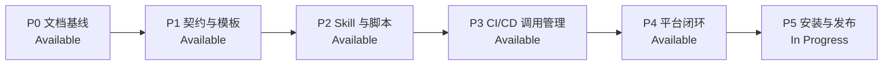

# AI Coding Harness 实施计划

版本：`0.3.0`
最后更新：2026-07-24
总体状态：P0–P4 Available（P4 采用本地产品验收）；P5 In Progress

本文只记录实施阶段、依赖、交付物、状态和阶段验收。产品规则以 [`docs/specification.md`](docs/specification.md) 为准，用户可观察行为以 [`uc.md`](uc.md) 为准。

`0.3` 契约模型将 Plan 与 Approval 分离，并用摘要链绑定运行时产物；权限模型仍只控制 Agent / Skill 自动调用 CI/CD 动作。Runtime、CLI、Shell、MCP、API 和普通仓库脚本由 Tool Registry 提供确定入口和使用指导，不由 Registry 承担身份授权或逐次审批。

## 目录

- [1. 状态定义](#1-状态定义)
- [2. 阶段依赖](#2-阶段依赖)
- [3. P0：完整文档基线](#3-p0完整文档基线)
- [4. P1：配置契约与模板](#4-p1配置契约与模板)
- [5. P2：Skill 与确定性脚本](#5-p2skill-与确定性脚本)
- [6. P3：可运行交付管理](#6-p3可运行交付管理)
- [7. P4：CI/CD 平台闭环接口](#7-p4cicd-平台闭环接口)
- [8. P5：评测与发布](#8-p5评测与发布)
- [9. 技术默认与变更门禁](#9-技术默认与变更门禁)
- [10. 总体验收](#10-总体验收)

## 1. 状态定义

| 状态 | 含义 |
|---|---|
| `Planned` | 范围与验收已确定，尚未开始实现 |
| `In Progress` | 已开始实现，但阶段验收尚未全部通过 |
| `Blocked` | 存在明确外部依赖或用户决策，无法继续 |
| `Available` | 阶段交付物存在且验收通过 |

状态只能在对应阶段验收完成后变更为 `Available`。README 和 Quickstart 的状态投影必须与本文件一致。

## 2. 阶段依赖

阶段必须顺序推进。后续阶段可以在独立分支中预研，但不得在前置阶段验收前声明为 Available。

## 3. P0：完整文档基线

**状态**：Available  
**依赖**：无

### 交付物

- `docs/specification.md`：唯一规范来源和稳定规则编号。
- `uc.md`：`UC-001` 至 `UC-012` 的完整用户用例。
- `docs/repository-structure.md`：开发仓库、Skill 包和目标项目的结构边界。
- `README.md`：最终产品入口和能力状态矩阵。
- `docs/quickstart.md`：Adopt、Bootstrap、Work/Merge、Publish 四条完整路径。
- `plan.md`：P0 至 P5 的实施路线。

### 阶段验收

- 所有内部 Markdown 链接可解析。
- 每个 `UC-*` 至少引用一条规范规则。
- `WB-*`、`TR-*`、`DM-*`、`HF-*`、`EV-*` 都有用例覆盖。
- README、Quickstart 和本文件的状态一致。
- Registry 示例中不存在 Agent / Skill 身份授权矩阵。
- 文档明确区分 Tool Registry 的注册引导与 CI/CD 动作的权限管控。

## 4. P1：配置契约与模板

**状态**：Available  
**依赖**：P0 Available

### 实施内容

1. 建立 Python 3.12 项目基础：
   - 创建 `pyproject.toml` 和 `uv.lock`。
   - 生产依赖使用 YAML 解析与 JSON Schema 校验库。
   - 测试依赖使用 `pytest`。
2. 为目标项目配置创建机器契约：
   - `harness.schema.json`
   - `boundaries.schema.json`
   - `tools.schema.json`
   - `tasks.schema.json`
   - `impact.schema.json`
   - `pipeline.schema.json`
3. 在开发仓库的过渡源目录建立契约与模板：
   - `contracts/schemas/`
   - `templates/scaffold/`
   - `templates/backends/local/`
   - `templates/backends/github-actions/`
   - P1 不得提前手工创建 Skill 目录。
4. 创建目标项目的最小 `AGENTS.md` 和 `.harness/` 模板。
5. 创建本仓库自用 `.harness/`，用自身配置验证规范。
6. 创建合法、缺字段、未知字段、跨文件引用失效等 Schema Fixture。

### 接口要求

- YAML 是用户维护格式，Validator 将 YAML 解析后交给 JSON Schema。
- Schema 默认拒绝未知政策字段，尤其是身份授权矩阵。
- `tools.yaml` 的 `invocation_mode` 只能是 `direct` 或 `managed`；`managed` 必须引用有效 `task_ref`。
- Tool 条目以“可调用能力或动作”为粒度；同一 executable 的不同语义使用独立条目，不能用一个 `direct` Runtime 条目覆盖其项目级 Test、Build 或 Publish 参数。
- 运行目录 `runs/`、`reports/`、`cache/` 必须由模板 `.gitignore` 排除。
- blocker code 的唯一枚举位置由共享契约定义，Schema 与未来 Python 代码引用同一来源。

### 阶段验收

- 所有合法 Fixture 通过 Schema 校验。
- 所有非法 Fixture 返回稳定失败原因。
- `tools.yaml` Fixture 能描述 Runtime、CLI、MCP Server 和 MCP Tool。
- 同一 executable 的 `direct` 与 `managed` 动作可以区分，且 `managed` 动作必须解析到有效 Task。
- `tasks.yaml` 与 `impact.yaml` 的引用可以执行跨文件校验。
- 模板渲染快照不包含运行日志、缓存或 Skill 开发文档。
- 本仓库 `.harness/` 能通过相同契约，不使用特殊例外。

## 5. P2：Skill 与确定性脚本

**状态**：Available  
**依赖**：P1 Available

### 实施内容

1. 使用 `skill-creator` 提供的初始化脚本，在 `skills/` 下创建 `initialize-ai-coding-harness`。
2. 根据完成后的 `SKILL.md` 生成 `agents/openai.yaml`，不手写不受约束的 UI 元数据。
3. 将 P1 验证过的契约与模板迁入该 Skill 的唯一资源位置：
   - `assets/scaffold/`
   - `assets/schemas/`
   - `assets/backends/local/`
   - `assets/backends/github-actions/`
   - 更新测试引用后删除过渡源目录，禁止维护重复副本。
4. `SKILL.md` 只负责意图识别、流程路由、Handoff 和资源选择。
5. 创建按需 References：
   - 核心模型
   - Tool Registry
   - Delivery Model
   - Adopt
   - Bootstrap
6. 实现确定性 Python：
   - `discover_repository.py`
   - `build_plan.py`
   - `apply_scaffold.py`
   - `validate_scaffold.py`
   - 共享 `harness_core/`
7. 实现四种入口：
   - Adopt
   - Bootstrap
   - Audit
   - Update

### 行为要求

- Discover 和 Audit 必须只读。
- Apply 只能执行用户确认 Plan 中列出的路径和动作。
- 同一仓库重复 Adopt、Bootstrap 或 Update 必须幂等。
- 已有 Workflow 只建立引用，除非用户明确批准改写。
- Adopt 必须发现 `AGENTS.md`：不存在时列入 `create`；存在时列入 `update` 并展示保留已有指令的合并 Diff，禁止模板覆盖。
- 受保护 Workflow 存在直接外部触发时返回 `PROTECTED_TRIGGER_UNCONTROLLED`；未改造前不得报告 Adopt 完成。
- Skill 包内不得出现 README、Quickstart、Changelog 或开发计划。

### 阶段验收

- Skill 通过官方结构验证。
- `agents/openai.yaml` 与 `SKILL.md` 一致。
- Python 单元测试覆盖发现、计划、应用、校验和 blocker codes。
- 空项目、已有 GitHub Actions、Python、Node、Monorepo Fixture 均有集成结果。
- Audit 模式不改变任何 Fixture 校验和。
- 第二次执行幂等操作时 Diff 为空。

## 6. P3：可运行交付管理

**状态**：Available（`0.3` 契约模型）
**依赖**：P2 Available

### 实施内容

1. 先更新 `docs/specification.md`、`uc.md`、README 和 Quickstart：
   - Tool Registry 只负责 Runtime、CLI、Shell、MCP、API 和普通脚本的确定索引与使用指导。
   - Registry 不承担 Agent / Skill 身份授权、普通工具逐次审批或调用转发。
   - 只有命中 Test、Build、CI、Push、Merge、Publish、Release 或 Deploy 语义的动作进入 Delivery Management。
   - 是否受控由动作语义决定，不由 Shell、CLI、MCP 或 API 等传输方式决定。
2. 扩展 Task 契约，为 CI/CD 动作声明自动化等级：
   - `routine`：低成本常规检查；只有项目明确登记允许时才可自动执行。
   - `expensive`：Integration、E2E、Full CI 或大型 Build；禁止自动执行，必须确认。
   - `critical`：Push、Merge、Publish、Release 或 Deploy；禁止自动执行，每次必须确认。
   - 未声明或无法分类的 CI/CD 动作默认按 `confirmation-required` 处理。
3. 实现 `select_validation.py`：
   - 比较 Change Manifest 与实际 Diff。
   - 读取 Task、Impact、模块、依赖和公共契约事实。
   - 输出验证级别、选中和跳过的 Task 及选择原因。
   - 只自动选择明确标记为 `routine` 且允许自动执行的最低充分验证。
   - 高成本或关键动作只生成 Request，不调用 Backend。
4. 实现 `run_task.py`：
   - 调度已选择 Task。
   - 应用超时和工作目录。
   - 归一化 Backend 结果。
   - 保存完整日志并返回结构化 Evidence。
   - 未经确认不得调度 `expensive` 或 `critical` Task。
5. 实现首批 Adapter：
   - Local Python
   - Local Node
   - GitHub Actions Python
   - GitHub Actions Node
6. 实现 CI/CD Request、Merge Pipeline 和 Publish Pipeline：
   - 重要门禁只能形成待确认 Request。
   - CI/CD 平台返回的状态才是 Merge、Publish 或 Deploy 的权威 Evidence。
   - 本地或未受控执行结果可以用于调试，但不能推动正式交付状态。
7. 实现渐进式日志读取，默认只向 Agent 返回首个有效错误和必要定位信息。
8. 扩展同一 `initialize-ai-coding-harness` Skill：
   - 在 `SKILL.md` 增加 Work、Verify、Merge 和 Publish 路由。
   - 更新对应 References 与资源路由。
   - 从更新后的 Skill 内容重新生成 `agents/openai.yaml`。
   - 增加四类用户表达的触发测试，避免日常流程落入未知入口。

### 行为要求

- Runtime、CLI、Shell、MCP、API 和普通仓库脚本默认只做注册引导；普通动作查询后直接调用。
- 同一 executable 或 Tool 的不同动作语义必须分开登记。例如 Python 分析可以是 `direct`，`python -m pytest` 必须映射到 Test Task。
- MCP Tool 若执行 Merge、Publish、Deploy 等 CI/CD 语义，仍必须进入受控 Task；Registry 不能因为传输方式是 MCP 就把它视为普通动作。
- Agent 只能建议验证，不能决定最终 Task 集。
- 默认选择最低充分验证；没有规范事实不得升级为 `full`。
- 影响范围不明时返回 `IMPACT_UNRESOLVED`，不静默运行全量 CI。
- 只有显式登记允许自动执行的 `routine` Task 可以由 Agent / Skill 自动触发。
- Integration、E2E、Full CI、大型 Build 以及其他 `expensive` Task 必须先生成 Request 并等待本次确认。
- Push、Merge、Publish、Release、Deploy 以及其他 `critical` Task 必须获得绑定本次目标的明确确认；历史确认不得复用。
- 未分类的 CI/CD 动作默认禁止自动触发，不得以“更安全”或“顺手验证”为由执行。
- GitHub Actions Adapter 复用已有 Workflow；Bootstrap 只有在用户选择后才创建新 Workflow。
- 受保护 GitHub Actions Workflow 必须使用 Harness 可控的调用入口，例如 `workflow_dispatch`，或具有可追溯受控调用者的 `workflow_call`；外部事件只能创建待确认 Request。
- Harness 不控制普通 MCP、网络或 Shell 权限，也不宣称能阻止本地命令的所有变体；正式交付只接受 Harness / CI/CD 产生且绑定本次变更的 Evidence。

### 阶段验收

- 文档修改选择 `inspect`。
- 单模块修改选择 `affected`。
- 公共契约变化至少选择 `contract`。
- 只有规范允许的事实可以推荐 `full`，且 `full` 不得在无本次确认时自动启动。
- 明确允许的低成本 Unit Test 可以自动执行。
- Integration、E2E、Full CI 或大型 Build 在无本次确认时 Backend 调用次数为零。
- Push、Merge、Publish、Release 和 Deploy 在无本次确认时 Backend 调用次数为零。
- 通过 Shell、CLI、MCP 或 API 表达的相同 CI/CD 语义得到相同自动化等级和门禁结果。
- 普通 CLI、MCP Tool 和只读分析动作查询 Registry 后可以直接调用，不触发逐次审批。
- Local 与 GitHub Actions 对相同 Task 产生一致 Evidence 字段。
- 默认 Agent 输出不包含完整日志。
- Merge 缺少必要 Evidence 时保持 `blocked`。
- 通过官方 Harness 路径且 Publish 没有本次独立确认时，Backend 调用次数为零。
- Work、Verify、Merge 和 Publish 的代表性表达均能触发同一 Skill 的正确路由。

## 7. P4：CI/CD 平台闭环接口

**状态**：Available
**依赖**：P3 Available；本地正反平台事实 Fixture 与独立目录验证环境

**验收记录（2026-07-24）**：

- 已实现 `prepare → dispatch → poll → normalize` Adapter Protocol、三级 Pipeline 状态和 Platform Evidence 绑定。
- 已用本地 Fake GitHub Adapter 验证确认前零调用、确认后单次 Dispatch、轮询后才允许 `passed`，以及缺字段和跨链 Evidence 的阻断。
- 已完成本地 Schema、Fixture、Plan/Approval/Apply 和幂等验收。
- 本轮不创建真实 GitHub Run，也不执行 Merge、Publish、Release 或 Deploy。P4 的产品阶段按用户确认采用本地 Fixture、Fake Adapter、零调用断言和独立目录流程验收，现已 `Available`。

### 实施内容

1. 定义 Harness Request 与 CI/CD 平台权限的边界：
   - Agent / Skill 可以生成和提交 Request。
   - CI/CD 平台决定 Workflow、Push、Merge、Publish、Release 和 Deploy 是否获得执行权限。
   - 发布 Secret、OIDC 身份和高权限 Token 不得暴露给 Agent / Skill 或普通工具条目。
2. 为首批 GitHub Actions Adapter 建立平台映射：
   - Workflow Dispatch 或具有可追溯调用者的 Workflow Call。
   - Branch Protection 与 Required Checks。
   - Protected Environment 与部署审批。
   - 最小权限 Token 和短期 OIDC 身份。
3. 把 `routine`、`expensive` 和 `critical` 自动化等级映射到 CI/CD 调用策略：
   - `routine` 只有显式允许时可自动 Dispatch。
   - `expensive` 必须有本次确认后才能 Dispatch。
   - `critical` 必须同时满足本次确认和平台门禁。
4. 将 CI/CD 运行 ID、Workflow、提交摘要、确认状态、审批者和制品摘要归一化为 Evidence。
5. 对受保护 Workflow 的外部直接触发、过宽 Token 或缺失环境审批返回稳定 blocker codes，不把配置存在误报为权限已受控。

### 范围边界

- P4 不建设通用宿主强制根、完整进程中介、文件写入 Hook 或一次性进程能力凭证。
- P4 不强控普通 MCP、网络、Shell、Runtime、CLI 或本地工具调用。
- Registry 仍是确定索引，不是 Agent / Skill 身份授权矩阵。
- 本地执行可以用于调试，但不能替代 CI/CD 平台签发的正式 Evidence。
- 对 CI/CD 动作的不可绕过保证来自凭证隔离、Branch Protection、Protected Environment 和平台审批，而不是自由文本指令。

### 阻塞规则

若 CI/CD 凭证可被 Agent / Skill 直接读取，受保护 Workflow 可被未经确认的外部事件直接启动，或 Publish / Deploy 缺少平台级审批，则相关动作保持 `blocked`，并返回 `PROTECTED_TRIGGER_UNCONTROLLED`、`PUBLISH_CONFIRMATION_REQUIRED` 或 `HANDOFF_REQUIRED`。不得把 Skill 自律、仓库内确认文件或 Registry 条目描述为平台权限保证。

本地正反 Fixture、Fake Adapter 和独立目录流程构成 P4 的产品阶段验收。真实 GitHub Workflow、Run ID、Required Checks、审批、受保护分支或环境及适用制品摘要仍是每次正式交付的运行时门禁；本地验收不授予正式动作权限。

### 阶段验收

- 本地 `ready` 平台事实 Fixture 返回 `ready`。
- 过宽凭证、缺失 Required Checks、未受控触发器或缺少环境审批的 Fixture 返回稳定 blocker codes。
- 未确认或平台门禁失败的 Fixture Backend 调用次数为零。
- CI/CD Evidence Fixture 可追溯到 Workflow、提交摘要、本次确认、审批状态和制品摘要。
- 全新目录的 Local Bootstrap 只写入批准范围，Schema 与跨文件验证通过。
- 对同一 Bootstrap Plan 重复应用时 `changed: []`。
- 普通 MCP、CLI、Shell 和网络调用不经过 Harness 权限代理，且文档不声称对其进行强制控制。
- P4 本地产品验收通过，状态为 `Available`；真实平台 Evidence 按具体项目和具体交付请求逐次采集。

## 8. P5：评测与发布

**状态**：In Progress
**依赖**：P4 Available；正式安装与发布另需用户确认许可证、安装目标和发布渠道

**当前边界（2026-07-27）**：

- 已完成 7 项固定源码、隔离上下文的 P2/P3 前向回归评测，7/7 通过，每项 `15–16/16`，且没有 mandatory failure。
- 本地回归为 114 项 `pytest` 测试通过；官方 Skill 结构校验与本仓库 Scaffold 校验均通过。
- 评测摘要记录在 `evals/runs/p3-forward-eval-20260724.yaml`，绑定 Skill digest `sha256:093a474b91de43cd90d1c1ba4bc1922dd2c1232acefd5e29f6c27538e8787146`。
- 用户已确认：不添加许可证并保持私有；安装到当前用户 Codex Skills 目录；通过 GitHub 私有仓库 `bigsmartben/harness-scaffold` 的 `v0.3.0` 标签发布。
- P5 已进入安装与发布准备，状态为 `In Progress`。当前 Phase A 只同步文档和断言，不安装、不 Commit、不 Push、不 Merge、不 Release。
- Phase A Contract Task `test:contracts` 已通过：Backend 调用 1 次，无需 Confirmation，无 blocker；Evidence digest 为 `sha256:e54013cd70eb0cba7a1d9a4b1ec3116eaf8d70574c22db876ede363352a52797`。
- 为解除首次 Push 尚无远端 Workflow 的引导死锁，P3 增加窄化 `git-remote` Backend：只接受绑定 remote、完整 ref 和精确 commit 的本次确认，执行一次非 force Push；Merge、Publish、Release、Deploy 仍只接受平台门禁 Evidence。

### 实施内容

1. 建立 Skill 前向评测（Forward Evaluation）：
   - Bootstrap 空项目
   - Adopt 已有 CI
   - 避免不必要全量 CI
   - Registry 不是授权
   - 允许低成本 Routine Test 自动执行
   - 禁止自动运行高成本 Integration / Full CI
   - 未确认的 Push / Merge / Publish / Deploy
2. 使用无泄漏上下文的独立 Agent 运行评测。
3. 记录失败原始产物、Diff、Evidence 和 blocker codes。
4. 修订 Skill、脚本或契约，并重复代表性评测。
5. 用户选择许可证、安装目标和发布渠道后，完成安装与发布。

### 发布门禁

- Skill 结构验证通过。
- 单元、集成、契约和前向评测通过。
- README 与 Quickstart 状态矩阵更新为实际状态。
- 没有未解释的 `full` 验证。
- 没有把 Registry 描述为身份授权或普通工具代理。
- 没有把 Skill 声明式约束描述为 CI/CD 平台权限保证。
- 许可证、外部安装和发布已获得用户明确确认。

### 阶段验收

- 所有 `UC-001` 至 `UC-012` 均有自动化测试或评测覆盖。
- 前向评测不依赖主任务隐藏结论。
- 安装后的 Skill 能被发现并正确触发。
- 发布产物不包含开发仓库专用文档、Fixture 或缓存。
- 发布记录可以追溯到测试和评测 Evidence。

## 9. 技术默认与变更门禁

### 技术默认

| 项目 | 决定 |
|---|---|
| 产品形态 | Skill + 内部 Python 执行层 |
| Python | 3.12，由 `uv` 管理 |
| 配置格式 | YAML，解析后由 JSON Schema 校验 |
| 路径处理 | `pathlib` |
| 子进程 | 参数数组，不拼接 Shell 命令字符串 |
| 测试 | `pytest`、Schema Fixture、集成 Fixture、Skill Evals |
| 平台 | Windows 与 Linux |
| V1 Backend | Local、Git Remote（仅 Push）、GitHub Actions |
| V1 项目类型 | Python、Node |
| 公共 CLI | V1 不发布 |
| Tool Registry | 普通 Tool / MCP / CLI / Shell 只注册和引导，不承担授权 |
| 自动化等级 | `routine`、`expensive`、`critical`；未分类 CI/CD 动作默认需确认 |
| 权限事实源 | CI/CD 凭证、Branch Protection、Protected Environment 与平台审批 |

### 不在首版范围

- GitLab CI、Jenkins 和其他 CI 平台。
- Java、Android、iOS、Flutter 等 Runtime。
- 云基础设施和数据库写入 Adapter。
- 多环境自动晋级和自动回滚。
- 组织级中心策略服务。
- 普通 MCP、网络、Shell、Runtime 或 CLI 的宿主级强制拦截。
- 通用文件写入强制根、完整进程中介或 Agent 身份授权矩阵。

### 变更门禁

以下变化必须先更新规范和受影响用例，再开始实现：

- 新增职责域或改变 Tool Registry 的“非授权”性质。
- 改变 CI/CD 动作的自动化等级、默认确认策略或平台权限事实源。
- 改变外部触发、Merge 或 Publish 的 Handoff 语义。
- 新增配置文件、顶层 Schema 字段或 blocker code。
- 将普通 Tool、MCP、CLI、Shell 或网络调用纳入权限管控。
- 将独立 Python CLI 变为公共用户接口。

## 10. 总体验收

完整路线完成时必须满足：

- 三层仓库结构与 [`docs/repository-structure.md`](docs/repository-structure.md) 一致。
- 所有核心规范规则有可运行测试或前向评测。
- Adopt 不无条件重写现有 CI/CD。
- Bootstrap 只生成所选技术栈和 Backend。
- Tool Registry 提供确定索引且不承担身份授权。
- Agent 不能自行决定或静默升级全量验证。
- 低成本 Task 只有项目显式允许时才可自动执行。
- 高成本 Integration、E2E、Full CI 或大型 Build 未经确认不会启动。
- Push、Merge、Publish、Release 和 Deploy 未经本次确认及平台门禁不会产生副作用。
- CI/CD 凭证、受保护分支、环境审批和正式 Evidence 的权威状态由 CI/CD 平台提供。
- Evidence 默认摘要化且完整日志可追溯。
- 外部事件和需要确认的 CI/CD 动作执行规定 Handoff。
- 普通 MCP、网络、Shell、Runtime 和 CLI 只做注册引导，产品不声称对其进行宿主级强控。
- 发布产物通过结构、契约、行为和安装验收。
